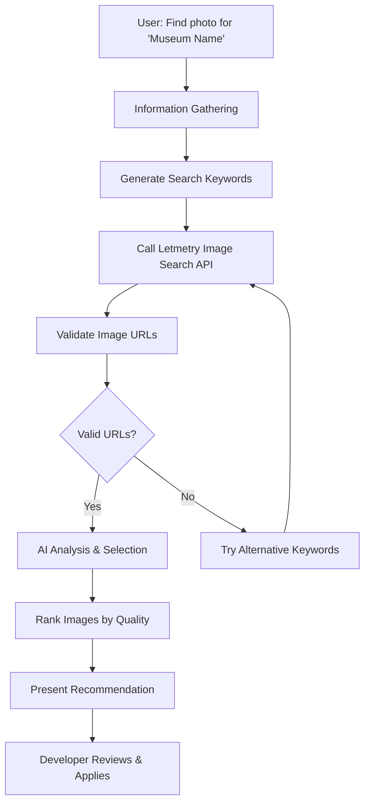

# Museum Photo Search

This skill provides AI-powered search and selection of high-quality museum building photos using Letmetry Cloud's image search API combined with Copilot's intelligent analysis.

## Scope of Application

- Finding photos for museums with empty `image` fields in museums-meta.json
- Searching for better quality museum building photos
- Batch processing multiple museums needing photos
- Quality validation of image URLs
- Developer assistance during museum data curation

## Prerequisites

### Required

1. **Letmetry Cloud API Access**
   - Endpoint: `https://letmetry.cloud/image/search`
   - No authentication required (public API)
   - Network connectivity

2. **Museum Data Context**
   - Access to `data/museums-meta.json`
   - Museum name and basic information
   - Understanding of museum location/context

3. **Node.js Environment** (for inline code execution)
   - Version 14+ required
   - `fetch` or `node-fetch` for HTTP requests

## Workflow Overview



---

## Step 1: Information Gathering Phase

### 1.1 Photo Search Request Understanding

When user asks to find museum photos, clarify the scope:

```
User Request Examples:
├── "Find photo for '故宫博物院'"
├── "Search museum image for 'National Museum of China'"
├── "Get best building photo for this museum"
├── "Find photos for all museums with empty image fields"
└── "Batch search images for these museums: [list]"
```

### 1.2 Determine Search Type

| Type | Detection | Scope | Example |
|------|-----------|-------|---------|
| Single Museum | One museum name | Find one photo | "Find photo for 故宫博物院" |
| Batch Museums | Multiple names or empty filter | Find multiple photos | "Find photos for all empty image fields" |
| Better Photo | Replace existing | Improve quality | "Find better photo for this museum" |
| Validation | Check existing URL | Verify accessibility | "Verify museum photo URL works" |

### 1.3 Gather Museum Information

When searching for photos, collect:

| Item | Source | Purpose |
|------|--------|---------|
| Museum Name | User input or museums-meta.json | Primary search keyword |
| Location | museums-meta.json | Help disambiguate results |
| Museum Context | Description, tags | Refine search keywords |
| Existing Image URL | museums-meta.json | Check if replacement needed |
| Museum Type | Tags/description | Help evaluate photo relevance |

### 1.4 Verify Environment Setup

```javascript
// Check if Letmetry API is accessible
const testApi = async () => {
  try {
    const response = await fetch('https://letmetry.cloud/image/search', {
      method: 'POST',
      headers: { 'Content-Type': 'application/json' },
      body: JSON.stringify({ keyword: 'test', count: 1 })
    });
    const data = await response.json();
    console.log('✅ Letmetry API accessible:', data.success);
  } catch (error) {
    console.log('❌ API connection failed:', error.message);
  }
};
```

---

## Step 2: Image Search Phase

### 2.1 Generate Optimal Search Keywords

**Strategy: Combine museum name with context keywords**

```javascript
function generateSearchKeywords(museumName, location) {
  // Primary keyword: Museum name with contextual terms
  const primaryKeywords = [
    `${museumName} 博物馆外观`,
    `${museumName} 建筑`,
    `${museumName} museum exterior`,
    `${museumName} building`
  ];
  
  // Add location context if available
  if (location) {
    primaryKeywords.push(`${location} ${museumName}`);
  }
  
  return primaryKeywords;
}

// Example usage
const keywords = generateSearchKeywords('故宫博物院', '北京');
// Returns: ['故宫博物院 博物馆外观', '故宫博物院 建筑', ...]
```

**Keyword Optimization Guidelines:**

| Museum Type | Additional Keywords |
|-------------|---------------------|
| 历史博物馆 | 古建筑, historical building, architecture |
| 艺术博物馆 | 美术馆, art museum, gallery exterior |
| 科技博物馆 | 科技馆, science museum, modern building |
| 自然博物馆 | 自然博物馆, natural history museum |
| 专题博物馆 | Use specific theme keywords |

### 2.2 Call Letmetry Image Search API

**API Request Format:**

```javascript
async function searchMuseumImages(keyword, count = 10) {
  const endpoint = 'https://letmetry.cloud/image/search';
  
  const response = await fetch(endpoint, {
    method: 'POST',
    headers: {
      'Content-Type': 'application/json'
    },
    body: JSON.stringify({
      keyword: keyword,
      count: count  // Number of results (default: 10)
    })
  });
  
  if (!response.ok) {
    throw new Error(`API request failed: ${response.status}`);
  }
  
  const data = await response.json();
  return data;
}
```

**API Response Structure:**

```javascript
{
  success: true,
  images: [
    "https://example.com/image1.jpg",
    "https://example.com/image2.jpg",
    "https://example.com/image3.jpg"
    // ... more URLs
  ]
}
```

**Error Response:**

```javascript
{
  success: false,
  error: "Error message description"
}
```

### 2.3 Handle Multiple Search Keywords

**Strategy: Try primary keyword first, fallback to alternatives**

```javascript
async function searchWithMultipleKeywords(keywords, count = 10) {
  const allResults = [];
  
  for (const keyword of keywords) {
    try {
      console.log(`🔍 Searching with: "${keyword}"`);
      const result = await searchMuseumImages(keyword, count);
      
      if (result.success && result.images.length > 0) {
        console.log(`✅ Found ${result.images.length} images`);
        allResults.push({
          keyword: keyword,
          images: result.images
        });
      }
    } catch (error) {
      console.log(`⚠️ Search failed for "${keyword}":`, error.message);
    }
  }
  
  // Deduplicate and combine results
  const uniqueUrls = [...new Set(allResults.flatMap(r => r.images))];
  return uniqueUrls;
}
```

### 2.4 API Usage Best Practices

**Request Guidelines:**

| Parameter | Recommendation | Reason |
|-----------|---------------|---------|
| `count` | 10-15 | Balance between variety and API load |
| `keyword` | Chinese + English | Better coverage in image databases |
| Retry logic | 2-3 attempts | Handle transient network issues |
| Timeout | 30 seconds | Prevent hanging requests |

---

## Step 3: URL Validation Phase

### 3.1 Validate Image URL Accessibility

**Purpose: Filter out broken, inaccessible, or invalid image URLs**

```javascript
async function validateImageUrl(url, timeout = 10000) {
  try {
    const controller = new AbortController();
    const timeoutId = setTimeout(() => controller.abort(), timeout);
    
    const response = await fetch(url, {
      method: 'HEAD',  // HEAD request for efficiency
      signal: controller.signal
    });
    
    clearTimeout(timeoutId);
    
    return {
      url: url,
      accessible: response.ok,
      statusCode: response.status,
      contentType: response.headers.get('content-type'),
      contentLength: response.headers.get('content-length')
    };
  } catch (error) {
    return {
      url: url,
      accessible: false,
      error: error.message
    };
  }
}
```

### 3.2 Batch Validation with Progress

```javascript
async function validateImageUrls(urls) {
  console.log(`🔍 Validating ${urls.length} image URLs...`);
  
  const results = [];
  for (let i = 0; i < urls.length; i++) {
    const url = urls[i];
    console.log(`[${i + 1}/${urls.length}] Checking: ${url.substring(0, 60)}...`);
    
    const result = await validateImageUrl(url);
    results.push(result);
    
    if (result.accessible) {
      console.log(`  ✅ Accessible (${result.statusCode})`);
    } else {
      console.log(`  ❌ Failed: ${result.error || result.statusCode}`);
    }
  }
  
  const validUrls = results.filter(r => r.accessible);
  console.log(`\n✅ ${validUrls.length}/${urls.length} URLs are valid\n`);
  
  return validUrls;
}
```

### 3.3 Content Type Validation

**Ensure URLs point to actual images:**

```javascript
function isValidImageContentType(contentType) {
  const validTypes = [
    'image/jpeg',
    'image/jpg',
    'image/png',
    'image/webp',
    'image/gif'
  ];
  
  return validTypes.some(type => 
    contentType && contentType.toLowerCase().includes(type)
  );
}

function filterValidImages(validationResults) {
  return validationResults.filter(result => {
    const hasValidContentType = isValidImageContentType(result.contentType);
    
    if (!hasValidContentType) {
      console.log(`⚠️ Invalid content type: ${result.url}`);
      console.log(`   Content-Type: ${result.contentType}`);
    }
    
    return hasValidContentType;
  });
}
```

---

## Step 4: AI Selection Phase

### 4.1 Image Quality Evaluation Criteria

**Copilot should analyze each image URL based on these criteria:**

| Criterion | Weight | Good Indicators | Bad Indicators |
|-----------|--------|-----------------|----------------|
| **Museum Building Visible** | 40% | Clear exterior view, full building | Interior, artifacts only, unclear |
| **Image Quality** | 25% | High resolution, sharp, clear | Blurry, low-res, pixelated |
| **Angle & Composition** | 15% | Professional angle, good framing | Awkward angle, poor composition |
| **Lighting** | 10% | Good lighting, proper exposure | Dark, overexposed, poor contrast |
| **Authenticity** | 5% | Official, professional appearance | Watermarks, tourist photos |
| **Relevance** | 5% | Matches museum type, appropriate | Wrong building, unrelated |

### 4.2 AI Analysis Prompt Pattern

**When analyzing images, Copilot should:**

```markdown
Analyze these image URLs for the museum "{museumName}" located in {location}:

CONTEXT:
- Museum Name: {museumName}
- Location: {location}
- Museum Type: {type based on tags}
- Description: {brief description}

IMAGE URLS TO ANALYZE:
1. {url1}
2. {url2}
3. {url3}
...

ANALYSIS CRITERIA:
1. Museum building exterior clearly visible (40%)
2. High resolution and image quality (25%)
3. Professional angle and composition (15%)
4. Good lighting and exposure (10%)
5. Authentic/official appearance (5%)
6. Relevance to museum type (5%)

REQUIRED OUTPUT:
- Best Image URL: {selected URL}
- Confidence Score: {0-100}
- Reasoning: {why this image is best}
- Quality Assessment: {pros and cons}
- Alternative URLs: {ranked list of next best options}
```

### 4.3 URL Pattern Analysis

**Copilot can infer quality from URL patterns:**

```javascript
function analyzeUrlQuality(url) {
  const qualityIndicators = {
    highQuality: [
      /wikipedia\.org/i,           // Wikimedia images often high quality
      /museumcdn/i,                // Museum CDN likely official
      /official/i,                 // Official sources
      /\d{3,4}x\d{3,4}/,          // Dimension indicators (large)
      /high-res|hires|hd/i        // Quality keywords
    ],
    lowQuality: [
      /thumb|thumbnail/i,          // Thumbnail versions
      /avatar/i,                   // Small profile images
      /\d{1,2}x\d{1,2}/,          // Very small dimensions
      /cache|temp/i               // Cached/temporary files
    ],
    suspicious: [
      /\.ru\//i,                   // Some domains need verification
      /ad[sv]|banner/i,           // Advertising images
      /logo/i                      // Logos, not building photos
    ]
  };
  
  let score = 50; // Baseline
  
  qualityIndicators.highQuality.forEach(pattern => {
    if (pattern.test(url)) score += 10;
  });
  
  qualityIndicators.lowQuality.forEach(pattern => {
    if (pattern.test(url)) score -= 15;
  });
  
  qualityIndicators.suspicious.forEach(pattern => {
    if (pattern.test(url)) score -= 20;
  });
  
  return Math.max(0, Math.min(100, score));
}
```

### 4.4 Selection Decision Tree

```
Start with all valid URLs
    ↓
Filter by content type (must be image/*)
    ↓
Analyze URL patterns (remove obvious low-quality)
    ↓
Copilot visual analysis (based on URL context)
    ↓
Rank by composite score
    ↓
Select top 1 as best, top 3-5 as alternatives
    ↓
Present recommendation with reasoning
```

---

## Step 5: Results Presentation Phase

### 5.1 Recommendation Output Format

**Present results in structured format:**

```markdown
## 🎯 Museum Photo Search Results

### Museum: {museumName}
**Location:** {location}  
**Search Keywords Used:** {keywords}  
**Total URLs Found:** {total}  
**Valid URLs After Validation:** {validCount}

---

### ✅ RECOMMENDED IMAGE

**URL:** {bestImageUrl}

**Confidence Score:** {confidenceScore}/100

**Quality Assessment:**
- ✅ Museum building exterior clearly visible
- ✅ High resolution and sharp image quality
- ✅ Professional angle with good composition
- ✅ Excellent lighting and exposure
- ⚠️ {any minor concerns}

**Reasoning:**
{Detailed explanation of why this image is the best choice, 
including specific observations about the URL, expected quality, 
and relevance to the museum}

**Technical Details:**
- Status Code: 200 OK
- Content-Type: image/jpeg
- Content-Length: {size if available}
- Estimated Resolution: {if determinable from URL}

---

### 🔄 ALTERNATIVE OPTIONS

**Second Best:**
URL: {alternativeUrl1}
Score: {score}/100
Notes: {brief reasoning}

**Third Best:**
URL: {alternativeUrl2}
Score: {score}/100
Notes: {brief reasoning}

---

### 📋 NEXT STEPS

Developer should:
1. ✅ Review the recommended image URL above
2. ✅ Optionally open URL in browser to visually verify
3. ✅ Copy the URL to update museums-meta.json manually
4. ✅ If not satisfied, try alternative URLs or search again

**Manual Update Command:**
```javascript
// Update in museums-meta.json:
{
  "id": "{museumId}",
  "name": "{museumName}",
  "image": "{recommendedUrl}",  // <-- UPDATE THIS FIELD
  // ... other fields
}
```
```

### 5.2 Batch Results Summary

**For multiple museums:**

```markdown
## 📊 Batch Museum Photo Search Results

**Total Museums Processed:** {count}  
**Successful Searches:** {successCount}  
**Failed Searches:** {failCount}

---

### ✅ Successful Results ({successCount})

| Museum | Best URL | Score | Alternatives |
|--------|----------|-------|--------------|
| {name1} | [{url}]({url}) | {score}/100 | {count} options |
| {name2} | [{url}]({url}) | {score}/100 | {count} options |
...

### ❌ Failed Searches ({failCount})

| Museum | Reason | Suggestion |
|--------|--------|------------|
| {name} | No valid images found | Try manual search or different keywords |
| {name} | API error | Retry later or check network |

---

### 📋 Batch Update Guide

Review each recommended URL above, then update museums-meta.json:

```javascript
// For each successful result:
{
  "id": "{museumId}",
  "image": "{recommendedUrl}"
}
```
```

---

## Step 6: Fallback Strategies

### 6.1 No Valid Images Found

**If Letmetry API returns no usable results:**

```markdown
⚠️ No suitable images found via Letmetry API for "{museumName}"

**Fallback Options:**

1. **Try Wikimedia Commons Search:**
   - Manual search: https://commons.wikimedia.org/w/index.php?search={museumName}
   - Free licensed images
   - Often high quality official photos

2. **Try Alternative Keywords:**
   - Museum's English name (if available)
   - Add location: "{museumName} {location}"
   - Remove '博物院'/'博物馆' suffix

3. **Manual Search:**
   - Baidu Images: https://image.baidu.com/search/index?tn=baiduimage&word={museumName}
   - Google Images: https://images.google.com/search?q={museumName}
   - Museum official website

4. **Ask for Help:**
   - Request from museum official website
   - Contact museum for media kit
```

### 6.2 API Connection Issues

**If Letmetry API is unreachable:**

```javascript
async function searchWithRetry(keyword, maxRetries = 3) {
  for (let attempt = 1; attempt <= maxRetries; attempt++) {
    try {
      console.log(`🔄 Attempt ${attempt}/${maxRetries}...`);
      const result = await searchMuseumImages(keyword);
      
      if (result.success) {
        return result;
      }
    } catch (error) {
      console.log(`❌ Attempt ${attempt} failed: ${error.message}`);
      
      if (attempt < maxRetries) {
        const waitTime = attempt * 2000; // Exponential backoff
        console.log(`⏳ Waiting ${waitTime/1000}s before retry...`);
        await new Promise(resolve => setTimeout(resolve, waitTime));
      }
    }
  }
  
  throw new Error('All retry attempts failed');
}
```

### 6.3 All URLs Invalid

**If URL validation fails for all results:**

```markdown
⚠️ All returned image URLs failed validation

**Possible Causes:**
- Network issues preventing URL access
- Image hosting services blocking HEAD requests
- Temporary server issues
- Region restrictions (firewall)

**Resolution Steps:**
1. Check your network connection
2. Try again in a few minutes
3. Try alternative keywords
4. Use manual search methods (see fallback options)
```

---

## Complete Example: Single Museum Search

```javascript
// Complete workflow for finding a museum photo
async function findMuseumPhoto(museumName, location) {
  console.log(`\n🔍 Searching photo for: ${museumName} (${location})\n`);
  
  // Step 1: Generate keywords
  const keywords = [
    `${museumName} 博物馆外观`,
    `${museumName} 建筑`,
    `${location} ${museumName}`,
    `${museumName} museum building`
  ];
  
  console.log('📝 Search keywords:', keywords.join(', '));
  
  // Step 2: Search with multiple keywords
  const imageUrls = await searchWithMultipleKeywords(keywords, 10);
  
  if (imageUrls.length === 0) {
    console.log('❌ No images found. Try fallback strategies.');
    return null;
  }
  
  console.log(`\n✅ Found ${imageUrls.length} total image URLs\n`);
  
  // Step 3: Validate URLs
  const validResults = await validateImageUrls(imageUrls);
  
  // Step 4: Filter by content type
  const validImages = filterValidImages(validResults);
  
  if (validImages.length === 0) {
    console.log('❌ No valid image URLs found. Try alternative search.');
    return null;
  }
  
  // Step 5: Analyze and rank
  const rankedImages = validImages.map(result => ({
    ...result,
    urlQualityScore: analyzeUrlQuality(result.url),
    finalScore: analyzeUrlQuality(result.url) // Can be enhanced with more factors
  })).sort((a, b) => b.finalScore - a.finalScore);
  
  // Step 6: Present results
  console.log('\n' + '='.repeat(70));
  console.log('🎯 RECOMMENDED IMAGE');
  console.log('='.repeat(70));
  console.log(`\nURL: ${rankedImages[0].url}`);
  console.log(`Score: ${rankedImages[0].finalScore}/100`);
  console.log(`Status: ${rankedImages[0].statusCode}`);
  console.log(`Content-Type: ${rankedImages[0].contentType}`);
  
  if (rankedImages.length > 1) {
    console.log('\n' + '-'.repeat(70));
    console.log('🔄 ALTERNATIVE OPTIONS');
    console.log('-'.repeat(70));
    
    for (let i = 1; i < Math.min(4, rankedImages.length); i++) {
      console.log(`\n${i}. Score: ${rankedImages[i].finalScore}/100`);
      console.log(`   URL: ${rankedImages[i].url}`);
    }
  }
  
  return rankedImages;
}

// Example usage
await findMuseumPhoto('故宫博物院', '北京');
```

---

## Complete Example: Batch Processing

```javascript
// Batch process museums with empty images
async function batchFindMuseumPhotos(museumsFile = 'data/museums-meta.json') {
  // Read museums data
  const fs = require('fs');
  const museums = JSON.parse(fs.readFileSync(museumsFile, 'utf8'));
  
  // Filter museums with empty images
  const needsPhotos = museums.filter(m => !m.image || m.image === '');
  
  console.log(`\n📊 Found ${needsPhotos.length} museums needing photos\n`);
  
  const results = [];
  
  for (let i = 0; i < needsPhotos.length; i++) {
    const museum = needsPhotos[i];
    console.log(`\n[${ i + 1}/${needsPhotos.length}] Processing: ${museum.name}`);
    console.log('='.repeat(70));
    
    try {
      const photoResults = await findMuseumPhoto(museum.name, museum.location);
      
      if (photoResults && photoResults.length > 0) {
        results.push({
          museum: museum,
          success: true,
          bestUrl: photoResults[0].url,
          score: photoResults[0].finalScore,
          alternatives: photoResults.slice(1, 4).map(r => r.url)
        });
      } else {
        results.push({
          museum: museum,
          success: false,
          error: 'No valid images found'
        });
      }
    } catch (error) {
      results.push({
        museum: museum,
        success: false,
        error: error.message
      });
    }
    
    // Rate limiting: wait between requests
    if (i < needsPhotos.length - 1) {
      console.log('\n⏳ Waiting 2s before next museum...\n');
      await new Promise(resolve => setTimeout(resolve, 2000));
    }
  }
  
  // Summary
  console.log('\n' + '='.repeat(70));
  console.log('📊 BATCH PROCESSING SUMMARY');
  console.log('='.repeat(70));
  
  const successful = results.filter(r => r.success);
  const failed = results.filter(r => !r.success);
  
  console.log(`\n✅ Successful: ${successful.length}`);
  console.log(`❌ Failed: ${failed.length}`);
  
  // Detailed results
  if (successful.length > 0) {
    console.log('\n' + '-'.repeat(70));
    console.log('✅ SUCCESSFUL RESULTS');
    console.log('-'.repeat(70));
    
    successful.forEach((result, i) => {
      console.log(`\n${i + 1}. ${result.museum.name} (Score: ${result.score}/100)`);
      console.log(`   URL: ${result.bestUrl}`);
      console.log(`   Alternatives: ${result.alternatives.length} options`);
    });
  }
  
  if (failed.length > 0) {
    console.log('\n' + '-'.repeat(70));
    console.log('❌ FAILED SEARCHES');
    console.log('-'.repeat(70));
    
    failed.forEach((result, i) => {
      console.log(`\n${i + 1}. ${result.museum.name}`);
      console.log(`   Error: ${result.error}`);
    });
  }
  
  return results;
}

// Run batch processing
const results = await batchFindMuseumPhotos();
```

---

## Quality Assurance Checklist

Before considering a photo search complete, verify:

- [ ] Museum name and context correctly identified
- [ ] At least 2-3 different keywords attempted
- [ ] Letmetry API returned results (or fallback used)
- [ ] All URLs validated for accessibility
- [ ] Content-Type confirmed as image/*
- [ ] URL quality analysis performed
- [ ] Top recommendation has reasoning
- [ ] At least 2-3 alternatives provided (if available)
- [ ] Developer received clear next steps
- [ ] Results formatted for easy review

---

## Common Commands Quick Reference

```javascript
// Single museum search
await findMuseumPhoto('故宫博物院', '北京');

// Batch processing
const results = await batchFindMuseumPhotos('data/museums-meta.json');

// Just search without validation (faster)
const urls = await searchMuseumImages('故宫博物院 外观', 10);

// Just validate URLs
const validUrls = await validateImageUrls(urlArray);

// Analyze URL quality
const score = analyzeUrlQuality('https://example.com/image.jpg');
```

---

## Troubleshooting

| Issue | Cause | Resolution |
|-------|-------|------------|
| **No images found** | Keywords too specific | Try broader keywords, add location |
| **All URLs invalid** | Network/firewall issues | Check connection, try manual verification |
| **Low quality results** | Search keywords poor | Refine keywords, try English alternatives |
| **API timeout** | Network latency | Increase timeout, retry later |
| **Wrong building** | Name ambiguity | Add location context, verify visually |

---

## Related Skills

- **Museum Verification** - Verify museum names against official database
- **Museum Data Manager** - Manage museum database entries
- **Image URL Validator** - Validate and test image URLs

---

## Success Criteria

Museum photo search is complete when:

✅ Valid image URLs found and validated  
✅ Best image selected with clear reasoning  
✅ Alternative options provided  
✅ Recommendation presented to developer  
✅ Developer has clear instructions for manual update  
✅ Quality assessment documented  

---

**Last Updated:** January 13, 2026  
**Maintained By:** MuseumCheck Team  
**API Provider:** Letmetry Cloud (https://letmetry.cloud)
