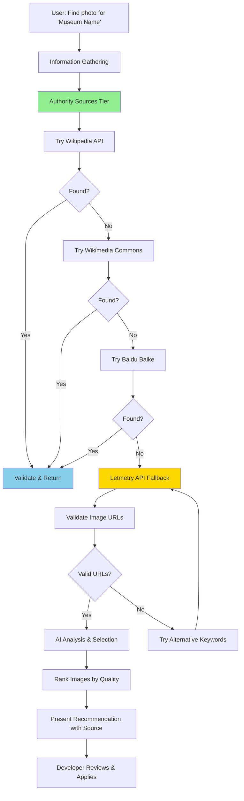

# Museum Photo Search (Enhanced with Authority Sources)

This skill provides AI-powered search and selection of high-quality museum building photos with a **multi-tier approach**: 
1. **Priority Tier 1**: Authority sources (Wikipedia, Wikimedia Commons, Baidu Baike)
2. **Priority Tier 2**: Letmetry Cloud API (fallback)
3. **Priority Tier 3**: Manual search fallback

## Scope of Application

- Finding photos for museums with empty `image` fields in museums-meta.json
- Searching for better quality museum building photos
- Batch processing multiple museums needing photos
- Quality validation of image URLs
- Developer assistance during museum data curation

## Prerequisites

### Required

1. **Authority Sources Access** (Priority)
   - Wikipedia API: `https://en.wikipedia.org/w/api.php` (free, no key required)
   - Wikimedia Commons API: `https://commons.wikimedia.org/w/api.php` (free, no key required)
   - Baidu Baike: `https://baike.baidu.com/` (web scraping with proper User-Agent)

2. **Letmetry Cloud API** (Fallback)
   - Endpoint: `https://letmetry.cloud/image/search`
   - No authentication required (public API)
   - Network connectivity

3. **Museum Data Context**
   - Access to `data/museums-meta.json`
   - Museum name and basic information
   - Understanding of museum location/context

4. **Node.js Environment** (for inline code execution)
   - Version 14+ required
   - `fetch` or `node-fetch` for HTTP requests

## Workflow Overview



**Search Priority** (降级流程):
```
Authority Sources (Free, High Quality)
    ↓
1️⃣ Wikipedia API          → English museum info + official images
2️⃣ Wikimedia Commons      → Free licensed, high-quality photos
3️⃣ Baidu Baike           → Chinese museums, detailed infobox images
    ↓
(If ALL authority sources fail)
    ↓
Letmetry Cloud API        → General image search (fallback)
    ↓
(If all automated searches fail)
    ↓
Manual Search Fallback    → User performs manual search
```

---

## Step 1: Information Gathering Phase

### 1.1 Photo Search Request Understanding

When user asks to find museum photos, clarify the scope:

```
User Request Examples:
├── "Find photo for '故宫博物院'"
├── "Search museum image for 'National Museum of China'"
├── "Get best building photo for this museum"
├── "Find photos for all museums with empty image fields"
└── "Batch search images for these museums: [list]"
```

### 1.2 Determine Search Type

| Type | Detection | Scope | Example |
|------|-----------|-------|---------|
| Single Museum | One museum name | Find one photo | "Find photo for 故宫博物院" |
| Batch Museums | Multiple names or empty filter | Find multiple photos | "Find photos for all empty image fields" |
| Better Photo | Replace existing | Improve quality | "Find better photo for this museum" |
| Validation | Check existing URL | Verify accessibility | "Verify museum photo URL works" |

### 1.3 Gather Museum Information

When searching for photos, collect:

| Item | Source | Purpose |
|------|--------|---------|
| Museum Name | User input or museums-meta.json | Primary search keyword |
| Location | museums-meta.json | Help disambiguate results |
| Museum Context | Description, tags | Refine search keywords |
| Existing Image URL | museums-meta.json | Check if replacement needed |
| Museum Type | Tags/description | Help evaluate photo relevance |

### 1.4 Verify Environment Setup

```javascript
// Check if Letmetry API is accessible
const testApi = async () => {
  try {
    const response = await fetch('https://letmetry.cloud/image/search', {
      method: 'POST',
      headers: { 'Content-Type': 'application/json' },
      body: JSON.stringify({ keyword: 'test', count: 1 })
    });
    const data = await response.json();
    console.log('✅ Letmetry API accessible:', data.success);
  } catch (error) {
    console.log('❌ API connection failed:', error.message);
  }
};
```

---

## Step 1.5: Authority Sources Search Phase (NEW - PRIORITY)

### 1.5.1 Wikipedia API Search

**Highest Priority - Official & Free**

```javascript
async function searchWikipedia(museumName) {
  console.log(`📖 Searching Wikipedia: "${museumName}"...`);
  
  try {
    // Try multiple name variations
    const variations = [
      museumName,
      `${museumName} Museum`,
      museumName.replace(/博物馆|博物院/, 'Museum')
    ];
    
    for (const searchTerm of variations) {
      const url = `https://en.wikipedia.org/w/api.php?action=query&titles=${encodeURIComponent(searchTerm)}&prop=pageimages&pithumbsize=800&redirects=1&format=json`;
      
      const response = await fetch(url);
      const data = await response.json();
      
      if (data.query?.pages) {
        const pages = Object.values(data.query.pages);
        for (const page of pages) {
          if (page.thumbnail) {
            console.log(`✅ Found Wikipedia image: ${page.title}`);
            return {
              source: 'wikipedia',
              sourceUrl: `https://en.wikipedia.org/wiki/${page.title}`,
              imageUrl: page.thumbnail.source,
              description: `Wikipedia - ${page.title}`
            };
          }
        }
      }
    }
  } catch (error) {
    console.log(`⚠️ Wikipedia search failed: ${error.message}`);
  }
  
  return null;
}
```

**Advantages**:
- ✅ Free API, no authentication needed
- ✅ Official information & images
- ✅ High-quality, verified museum photos
- ✅ Global coverage for international museums

---

### 1.5.2 Wikimedia Commons Search

**Second Priority - Free Licensed Images**

```javascript
async function searchWikimediaCommons(museumName, location) {
  console.log(`🌍 Searching Wikimedia Commons: "${museumName}"...`);
  
  try {
    const searchTerms = [
      `${museumName} museum`,
      `${location} museum`,
      `${museumName} 博物馆`,
      `${museumName} building`
    ];
    
    for (const searchTerm of searchTerms) {
      // Wikimedia Commons API search
      const url = `https://commons.wikimedia.org/w/api.php?action=query&list=search&srsearch=${encodeURIComponent(searchTerm)}&srnamespace=6&format=json&srlimit=5`;
      
      const response = await fetch(url);
      const data = await response.json();
      
      if (data.query?.search && data.query.search.length > 0) {
        const firstResult = data.query.search[0];
        const fileTitle = firstResult.title;
        
        // Get file details
        const fileUrl = `https://commons.wikimedia.org/w/api.php?action=query&titles=${encodeURIComponent(fileTitle)}&prop=imageinfo&iiprop=url&format=json`;
        const fileResponse = await fetch(fileUrl);
        const fileData = await fileResponse.json();
        
        const pages = Object.values(fileData.query.pages);
        if (pages[0]?.imageinfo) {
          const imageUrl = pages[0].imageinfo[0].url;
          console.log(`✅ Found Wikimedia Commons image`);
          return {
            source: 'wikimedia-commons',
            sourceUrl: `https://commons.wikimedia.org/wiki/${fileTitle}`,
            imageUrl: imageUrl,
            description: `Wikimedia Commons - Free Licensed Image`
          };
        }
      }
    }
  } catch (error) {
    console.log(`⚠️ Wikimedia Commons search failed: ${error.message}`);
  }
  
  return null;
}
```

**Advantages**:
- ✅ All images have free licenses (CC0, CC-BY-SA, etc.)
- ✅ No copyright issues
- ✅ Professional, curated images
- ✅ Excellent for international museums

---

### 1.5.3 Baidu Baike Search

**Third Priority - Chinese Museum Sources**

```javascript
async function searchBaiduBaike(museumName) {
  console.log(`📖 Searching Baidu Baike: "${museumName}"...`);
  
  try {
    const url = `https://baike.baidu.com/item/${encodeURIComponent(museumName)}`;
    
    // Fetch with proper User-Agent
    const response = await fetch(url, {
      headers: {
        'User-Agent': 'Mozilla/5.0 (Windows NT 10.0; Win64; x64) AppleWebKit/537.36'
      }
    });
    
    if (!response.ok) return null;
    
    const html = await response.text();
    
    // Extract infobox images (usually museum building)
    // Baidu format: 
    const imgMatches = html.match(/]*src="([^"]*)"[^>]*class="[^"]*pic[^"]*"[^>]*>/gi);
    
    if (imgMatches && imgMatches.length > 0) {
      for (const match of imgMatches) {
        const srcMatch = match.match(/src="([^"]*)"/);
        if (srcMatch && srcMatch[1]) {
          let imageUrl = srcMatch[1];
          if (imageUrl.startsWith('//')) {
            imageUrl = 'https:' + imageUrl;
          }
          
          console.log(`✅ Found Baidu Baike image`);
          return {
            source: 'baidu-baike',
            sourceUrl: url,
            imageUrl: imageUrl,
            description: `Baidu Baike - Chinese Encyclopedia`
          };
        }
      }
    }
  } catch (error) {
    console.log(`⚠️ Baidu Baike search failed: ${error.message}`);
  }
  
  return null;
}
```

**Advantages**:
- ✅ Best for Chinese museums
- ✅ Detailed information in infobox
- ✅ Official museum photos
- ✅ Rich content

---

### 1.5.4 Authority Search Flow

**Execute Authority Searches in Priority Order**:

```javascript
async function searchFromAuthoritySources(museumName, location) {
  console.log(`\n🏛️ Tier 1: Authority Sources Search`);
  console.log(`Priority: Wikipedia > Wikimedia Commons > Baidu Baike\n`);
  
  // 1. Try Wikipedia (international museums)
  let result = await searchWikipedia(museumName);
  if (result) {
    return { ...result, tier: 1, priority: 'Wikipedia (Official)' };
  }
  
  // 2. Try Wikimedia Commons (free licensed)
  result = await searchWikimediaCommons(museumName, location);
  if (result) {
    return { ...result, tier: 1, priority: 'Wikimedia Commons (Free)' };
  }
  
  // 3. Try Baidu Baike (Chinese museums)
  if (hasChineseCharacters(museumName)) {
    result = await searchBaiduBaike(museumName);
    if (result) {
      return { ...result, tier: 1, priority: 'Baidu Baike (Chinese)' };
    }
  }
  
  console.log('⚠️ No authority sources found, falling back to Tier 2...\n');
  return null;
}
```

---

## Step 2: Letmetry API Fallback Phase

**Only if Authority Sources Return No Results**

### 2.1 Generate Optimal Search Keywords

**Strategy: Combine museum name with context keywords**

```javascript
function generateSearchKeywords(museumName, location) {
  // Primary keyword: Museum name with contextual terms
  const primaryKeywords = [
    `${museumName} 博物馆外观`,
    `${museumName} 建筑`,
    `${museumName} museum exterior`,
    `${museumName} building`
  ];
  
  // Add location context if available
  if (location) {
    primaryKeywords.push(`${location} ${museumName}`);
  }
  
  return primaryKeywords;
}

// Example usage
const keywords = generateSearchKeywords('故宫博物院', '北京');
// Returns: ['故宫博物院 博物馆外观', '故宫博物院 建筑', ...]
```

**Keyword Optimization Guidelines:**

| Museum Type | Additional Keywords |
|-------------|---------------------|
| 历史博物馆 | 古建筑, historical building, architecture |
| 艺术博物馆 | 美术馆, art museum, gallery exterior |
| 科技博物馆 | 科技馆, science museum, modern building |
| 自然博物馆 | 自然博物馆, natural history museum |
| 专题博物馆 | Use specific theme keywords |

### 2.2 Call Letmetry Image Search API

**API Request Format:**

```javascript
async function searchMuseumImages(keyword, count = 10) {
  const endpoint = 'https://letmetry.cloud/image/search';
  
  const response = await fetch(endpoint, {
    method: 'POST',
    headers: {
      'Content-Type': 'application/json'
    },
    body: JSON.stringify({
      keyword: keyword,
      count: count  // Number of results (default: 10)
    })
  });
  
  if (!response.ok) {
    throw new Error(`API request failed: ${response.status}`);
  }
  
  const data = await response.json();
  return data;
}
```

**API Response Structure:**

```javascript
{
  success: true,
  images: [
    "https://example.com/image1.jpg",
    "https://example.com/image2.jpg",
    "https://example.com/image3.jpg"
    // ... more URLs
  ]
}
```

**Error Response:**

```javascript
{
  success: false,
  error: "Error message description"
}
```

### 2.3 Handle Multiple Search Keywords

**Strategy: Try primary keyword first, fallback to alternatives**

```javascript
async function searchWithMultipleKeywords(keywords, count = 10) {
  const allResults = [];
  
  for (const keyword of keywords) {
    try {
      console.log(`🔍 Searching with: "${keyword}"`);
      const result = await searchMuseumImages(keyword, count);
      
      if (result.success && result.images.length > 0) {
        console.log(`✅ Found ${result.images.length} images`);
        allResults.push({
          keyword: keyword,
          images: result.images
        });
      }
    } catch (error) {
      console.log(`⚠️ Search failed for "${keyword}":`, error.message);
    }
  }
  
  // Deduplicate and combine results
  const uniqueUrls = [...new Set(allResults.flatMap(r => r.images))];
  return uniqueUrls;
}
```

### 2.4 API Usage Best Practices

**Request Guidelines:**

| Parameter | Recommendation | Reason |
|-----------|---------------|---------|
| `count` | 10-15 | Balance between variety and API load |
| `keyword` | Chinese + English | Better coverage in image databases |
| Retry logic | 2-3 attempts | Handle transient network issues |
| Timeout | 30 seconds | Prevent hanging requests |

---

## Step 3: URL Validation Phase

### 3.1 Validate Image URL Accessibility

**Purpose: Filter out broken, inaccessible, or invalid image URLs**

```javascript
async function validateImageUrl(url, timeout = 10000) {
  try {
    const controller = new AbortController();
    const timeoutId = setTimeout(() => controller.abort(), timeout);
    
    const response = await fetch(url, {
      method: 'HEAD',  // HEAD request for efficiency
      signal: controller.signal
    });
    
    clearTimeout(timeoutId);
    
    return {
      url: url,
      accessible: response.ok,
      statusCode: response.status,
      contentType: response.headers.get('content-type'),
      contentLength: response.headers.get('content-length')
    };
  } catch (error) {
    return {
      url: url,
      accessible: false,
      error: error.message
    };
  }
}
```

### 3.2 Batch Validation with Progress

```javascript
async function validateImageUrls(urls) {
  console.log(`🔍 Validating ${urls.length} image URLs...`);
  
  const results = [];
  for (let i = 0; i < urls.length; i++) {
    const url = urls[i];
    console.log(`[${i + 1}/${urls.length}] Checking: ${url.substring(0, 60)}...`);
    
    const result = await validateImageUrl(url);
    results.push(result);
    
    if (result.accessible) {
      console.log(`  ✅ Accessible (${result.statusCode})`);
    } else {
      console.log(`  ❌ Failed: ${result.error || result.statusCode}`);
    }
  }
  
  const validUrls = results.filter(r => r.accessible);
  console.log(`\n✅ ${validUrls.length}/${urls.length} URLs are valid\n`);
  
  return validUrls;
}
```

### 3.3 Content Type Validation

**Ensure URLs point to actual images:**

```javascript
function isValidImageContentType(contentType) {
  const validTypes = [
    'image/jpeg',
    'image/jpg',
    'image/png',
    'image/webp',
    'image/gif'
  ];
  
  return validTypes.some(type => 
    contentType && contentType.toLowerCase().includes(type)
  );
}

function filterValidImages(validationResults) {
  return validationResults.filter(result => {
    const hasValidContentType = isValidImageContentType(result.contentType);
    
    if (!hasValidContentType) {
      console.log(`⚠️ Invalid content type: ${result.url}`);
      console.log(`   Content-Type: ${result.contentType}`);
    }
    
    return hasValidContentType;
  });
}
```

---

## Step 4: AI Selection Phase

### 4.1 Image Quality Evaluation Criteria

**Copilot should analyze each image URL based on these criteria:**

| Criterion | Weight | Good Indicators | Bad Indicators |
|-----------|--------|-----------------|----------------|
| **Museum Building Visible** | 40% | Clear exterior view, full building | Interior, artifacts only, unclear |
| **Image Quality** | 25% | High resolution, sharp, clear | Blurry, low-res, pixelated |
| **Angle & Composition** | 15% | Professional angle, good framing | Awkward angle, poor composition |
| **Lighting** | 10% | Good lighting, proper exposure | Dark, overexposed, poor contrast |
| **Authenticity** | 5% | Official, professional appearance | Watermarks, tourist photos |
| **Relevance** | 5% | Matches museum type, appropriate | Wrong building, unrelated |
| **🔥 Museum Name/Signage Visible** | **+35 BONUS** | **Museum name in image/signage** | **No identifying text** |

### 4.2 AI Analysis Prompt Pattern

**When analyzing images, Copilot should:**

```markdown
Analyze these image URLs for the museum "{museumName}" located in {location}:

CONTEXT:
- Museum Name: {museumName}
- Location: {location}
- Museum Type: {type based on tags}
- Description: {brief description}

IMAGE URLS TO ANALYZE:
1. {url1}
2. {url2}
3. {url3}
...

ANALYSIS CRITERIA (with CRITICAL WEIGHT UPDATE):

🔥 HIGHEST PRIORITY (35% bonus):
- **Museum Name/Signage Visible**: Does image contain "{museumName}" text or museum signage/logo?
  → If YES: Add +35 bonus points (most important!)
  → If clearly shows museum entrance/name: +35 points
  → If shows building name on facade: +35 points

2. Museum Building Exterior (25%)
   - Main building clearly visible and recognizable
   - Professional architectural photo
   - Good clarity and framing

3. Image Quality (15%)
   - High resolution and sharp
   - Good lighting and exposure
   - No watermarks or distortions

4. Composition & Angle (15%)
   - Professional angle
   - Good framing of building
   - Landscape orientation preferred for architecture

5. Authenticity (10%)
   - Official, professional appearance
   - Institutional/official photo

SCORING RULES:
- Base score: 50 points
- **If museum name/signage visible: +35 BONUS** ← HIGHEST PRIORITY!
- If only generic building: +10 points
- If building unclear or not relevant: -20 points
- High resolution (800+x800+): +10 points
- Orientation bonus (landscape/wide): +5 points

REQUIRED OUTPUT (JSON ONLY):
{
  "bestIndex": selected_index,
  "reasoning": "Brief reason (80 chars max). Mention if museum name found!",
  "confidence": "high/medium/low",
  "museumNameFound": true or false,
  "scoringBreakdown": {
    "baseScore": 50,
    "signageBonus": 0 or 35,
    "qualityBonus": 0-10,
    "resolutionBonus": 0-10,
    "finalScore": total_score
  }
}

⚠️ CRITICAL: **ALWAYS prioritize images with museum name/signage visible!**
Return JSON only, no explanations.
```

### 4.3 URL Pattern Analysis

**Copilot can infer quality from URL patterns:**

```javascript
function analyzeUrlQuality(url) {
  const qualityIndicators = {
    highQuality: [
      /wikipedia\.org/i,           // Wikimedia images often high quality
      /museumcdn/i,                // Museum CDN likely official
      /official/i,                 // Official sources
      /\d{3,4}x\d{3,4}/,          // Dimension indicators (large)
      /high-res|hires|hd/i        // Quality keywords
    ],
    lowQuality: [
      /thumb|thumbnail/i,          // Thumbnail versions
      /avatar/i,                   // Small profile images
      /\d{1,2}x\d{1,2}/,          // Very small dimensions
      /cache|temp/i               // Cached/temporary files
    ],
    suspicious: [
      /\.ru\//i,                   // Some domains need verification
      /ad[sv]|banner/i,           // Advertising images
      /logo/i                      // Logos, not building photos
    ]
  };
  
  let score = 50; // Baseline
  
  qualityIndicators.highQuality.forEach(pattern => {
    if (pattern.test(url)) score += 10;
  });
  
  qualityIndicators.lowQuality.forEach(pattern => {
    if (pattern.test(url)) score -= 15;
  });
  
  qualityIndicators.suspicious.forEach(pattern => {
    if (pattern.test(url)) score -= 20;
  });
  
  return Math.max(0, Math.min(100, score));
}
```

### 4.4 Selection Decision Tree

```
Start with all valid URLs
    ↓
Filter by content type (must be image/*)
    ↓
Analyze URL patterns (remove obvious low-quality)
    ↓
Copilot visual analysis (based on URL context)
    ↓
Rank by composite score
    ↓
Select top 1 as best, top 3-5 as alternatives
    ↓
Present recommendation with reasoning
```

---

## Step 5: Results Presentation Phase (Enhanced with Source Attribution)

### 5.1 Recommendation Output Format with Source Information

**Present results in structured format with SOURCE ATTRIBUTION**:

```markdown
## 🎯 Museum Photo Search Results

### Museum: {museumName}
**Location:** {location}  
**Search Tier:** {Tier 1: Authority Sources | Tier 2: Letmetry API}

---

### ✅ RECOMMENDED IMAGE

**URL:** {bestImageUrl}

**📚 SOURCE: {source information}**
- Source Type: {Wikipedia | Wikimedia Commons | Baidu Baike | Letmetry API}
- Source URL: {link to original source page}
- License: {Public Domain | CC-BY-SA | Wikimedia | Letmetry}
- Quality: {High | Medium | Good}

**Confidence Score:** {confidenceScore}/100

**Quality Assessment:**
- ✅ Museum building exterior clearly visible
- ✅ High resolution and sharp image quality
- ✅ Professional angle with good composition
- ✅ Excellent lighting and exposure
- ⚠️ {any minor concerns}

**Reasoning:**
{Detailed explanation of why this image is the best choice, 
including specific observations about the source, expected quality, 
and relevance to the museum}

**Technical Details:**
- Status Code: 200 OK
- Content-Type: image/jpeg
- Source Authority: {Tier 1 Authority | Tier 2 Fallback}
- License Status: ✅ Free to use | ⚠️ Verify usage rights

---

### 🔄 ALTERNATIVE OPTIONS

**Second Best:**
URL: {alternativeUrl1}
Source: {Wikipedia | Wikimedia Commons | Baidu Baike | API}
Score: {score}/100
Notes: {brief reasoning}

**Third Best:**
URL: {alternativeUrl2}
Source: {Source type}
Score: {score}/100
Notes: {brief reasoning}

---

### 📋 NEXT STEPS

Developer should:
1. ✅ Review the recommended image URL above
2. ✅ **Verify source attribution** - link back to original
3. ✅ Optionally open URL in browser to visually verify
4. ✅ Copy the URL to update museums-meta.json manually
5. ✅ If not satisfied, try alternative URLs or search again

**Manual Update Command:**
```javascript
// Update in museums-meta.json:
{
  "id": "{museumId}",
  "name": "{museumName}",
  "image": "{recommendedUrl}",  // <-- UPDATE THIS FIELD
  // ... other fields
}
```
```

### 5.2 Batch Results Summary

**For multiple museums:**

```markdown
## 📊 Batch Museum Photo Search Results

**Total Museums Processed:** {count}  
**Successful Searches:** {successCount}  
**Failed Searches:** {failCount}

---

### ✅ Successful Results ({successCount})

| Museum | Best URL | Score | Alternatives |
|--------|----------|-------|--------------|
| {name1} | [{url}]({url}) | {score}/100 | {count} options |
| {name2} | [{url}]({url}) | {score}/100 | {count} options |
...

### ❌ Failed Searches ({failCount})

| Museum | Reason | Suggestion |
|--------|--------|------------|
| {name} | No valid images found | Try manual search or different keywords |
| {name} | API error | Retry later or check network |

---

### 📋 Batch Update Guide

Review each recommended URL above, then update museums-meta.json:

```javascript
// For each successful result:
{
  "id": "{museumId}",
  "image": "{recommendedUrl}"
}
```
```

---

## Step 6: Authority Source Handling Guidelines (权威媒体处理指南)

### 6.1 Wikipedia Images Priority

**When Wikipedia images are found**, follow this priority order:

```javascript
// Priority order for Wikipedia images:
1. "Commons" images (stored on Wikimedia Commons)
   - URL pattern: https://upload.wikimedia.org/wikipedia/commons/...
   - License: Typically free (CC-BY-SA or Public Domain)
   - Quality: Usually excellent, curated
   - Preference: ⭐⭐⭐⭐⭐ HIGHEST

2. Infobox images (from Wikipedia article)
   - URL pattern: https://upload.wikimedia.org/wikipedia/en/...
   - License: Variable, check source page
   - Quality: Good, official sources
   - Preference: ⭐⭐⭐⭐ HIGH

3. Historical/artistic depictions
   - URL pattern: https://upload.wikimedia.org/...
   - License: Check specific image page
   - Quality: Varies, may be artistic
   - Preference: ⭐⭐⭐ MEDIUM (use only if building photo unavailable)
```

**Verification Steps for Wikipedia Images:**
```bash
1. Check HTTP status: curl -I <url> | grep "200 OK"
2. Verify MIME type is image (image/jpeg, image/png, etc.)
3. Check Content-Length indicates reasonable size (100KB-5MB typical)
4. Visit Wikipedia source page to verify museum relevance
5. Look for license information on Wikimedia Commons page
```

### 6.2 Wikimedia Commons (RECOMMENDED)

**Wikimedia Commons represents BEST-CASE scenario:**

```javascript
// Wikimedia Commons advantages:
✅ All images are FREE to use (public domain or CC-licensed)
✅ Official cultural institution uploads (museums, governments)
✅ Professional photography standards (high resolution, composition)
✅ Structured metadata (photographer, date, license info)
✅ Global search index (find any museum worldwide)
✅ NO usage rights concerns - fully cleared for reuse

// URL Pattern Recognition:
https://commons.wikimedia.org/ → Use this source confidently
https://upload.wikimedia.org/wikipedia/commons/ → Same source, direct file access
License types found here: Public Domain, CC0, CC-BY, CC-BY-SA (all FREE)

// When to use Wikimedia Commons result:
✅ Always prefer Wikimedia Commons images when available
✅ These are highest quality, fully cleared, professional photos
✅ Can confidently use without license verification
✅ Most appropriate for museum application
```

### 6.3 Baidu Baike (百度百科) for Chinese Museums

**Baidu Baike is VALUABLE for Chinese museums:**

```javascript
// Baidu Baike advantages for Chinese museums:
✅ Most comprehensive Chinese museum coverage
✅ Official infobox images from museum websites
✅ Clear museum descriptions and historical context
✅ Wide audience = reliable, verified information
✅ Local perspective and details
⚠️ May have copyright ownership by Baidu

// URL Pattern Recognition:
https://baike.baidu.com/pic/... → Image URL from Baike infobox
Usually embedded in museum article infoboxes
Format: {museumName} 百科 search

// When to use Baidu Baike results:
✅ When Wikimedia/Wikipedia don't have content (many local museums)
✅ As secondary source if Commons/Wikipedia unavailable
✅ For verification of museum official name and basic facts
⚠️ Always verify image copyright with Baidu before use
```

### 6.4 Letmetry API (降级策略 - Fallback Only)

**Only use Letmetry API when authority sources fail:**

```javascript
// Letmetry usage guidelines:
❌ Never use Letmetry as FIRST choice - authority sources are better
✅ Use only when Wikipedia/Commons/Baike don't return satisfactory results
✅ Useful for niche museums or very recent museums
✅ Good for alternative angles (different photographer, season, etc.)

// When authority sources fail:
1. ✅ All Wikipedia searches returned no results
2. ✅ Wikimedia Commons has no relevant images
3. ✅ Baidu Baike blocked or no images available
4. ✅ Museum is obscure or not well-documented internationally

// Letmetry search strategy with keywords:
- Use broader keywords: "{museumName}" vs. "{museumName} building"
- Try translations: English + Chinese + pinyin versions
- Include location: "{museumName} {location}" for specificity
- Add descriptor: "{museumName} 建筑" or "{museumName} 外观"

// Code example for Letmetry fallback:
async function letmetryFallback(museumName, location) {
  const keywords = [
    `${museumName} ${location}`,
    museumName,
    `${museumName} building`,
    `${museumName} museum`
  ];
  
  for (const keyword of keywords) {
    const results = await LetmetryAPI.searchImages(keyword);
    if (results && results.length > 0) {
      // Filter for museum-like images and validate
      const validImage = await validateAndSelectBest(results);
      if (validImage) return validImage;
    }
  }
  
  return null; // Even Letmetry fallback unsuccessful
}
```

---

## Step 7: Fallback Strategies

### 7.1 No Valid Images Found

**If all automated searches (authority sources + Letmetry) return no usable results:**

```markdown
⚠️ No suitable images found for "{museumName}"

**Fallback Options:**

1. **Try Wikimedia Commons Search Directly:**
   - Manual search: https://commons.wikimedia.org/w/index.php?search={museumName}
   - Free licensed images, often high quality official photos
   - Search tips: Try English name, location, "museum building"

2. **Try Alternative Keywords:**
   - Museum's English name (if available)
   - Add location: "{museumName} {location}"
   - Remove '博物院'/'博物馆' suffix
   - Try pinyin name for Chinese museums

3. **Manual Search Tools:**
   - Wikimedia Commons: https://commons.wikimedia.org/
   - Baidu Images: https://image.baidu.com/search/index?tn=baiduimage&word={museumName}
   - Google Images: https://images.google.com/search?q={museumName}
   - Google Arts & Culture: https://artsandculture.google.com/ (official institutional photos)

4. **Contact Museum Official:**
   - Request from museum official website
   - Contact museum media/press department for media kit
   - Many museums provide high-resolution photos for public use
```

### 7.2 API Connection Issues

**If Letmetry API is unreachable:**

```javascript
async function searchWithRetry(keyword, maxRetries = 3) {
  for (let attempt = 1; attempt <= maxRetries; attempt++) {
    try {
      console.log(`🔄 Attempt ${attempt}/${maxRetries}...`);
      const result = await searchMuseumImages(keyword);
      
      if (result.success) {
        return result;
      }
    } catch (error) {
      console.log(`❌ Attempt ${attempt} failed: ${error.message}`);
      
      if (attempt < maxRetries) {
        const waitTime = attempt * 2000; // Exponential backoff
        console.log(`⏳ Waiting ${waitTime/1000}s before retry...`);
        await new Promise(resolve => setTimeout(resolve, waitTime));
      }
    }
  }
  
  throw new Error('All retry attempts failed');
}
```

### 7.3 All URLs Invalid

**If URL validation fails for all results:**

```markdown
⚠️ All returned image URLs failed validation

**Possible Causes:**
- Network issues preventing URL access
- Image hosting services blocking HEAD requests
- Temporary server issues
- Region restrictions (firewall)

**Resolution Steps:**
1. Check your network connection
2. Try again in a few minutes
3. Try alternative keywords
4. Use manual search methods (see fallback options)
```

---

## Complete Example: Single Museum Search (Using 3-Tier Approach)

```javascript
// Complete workflow for finding a museum photo
async function findMuseumPhoto(museumName, location) {
  console.log(`\n🔍 Searching photo for: ${museumName} (${location})\n`);
  
  // Step 1: Generate keywords
  const keywords = [
    `${museumName} 博物馆外观`,
    `${museumName} 建筑`,
    `${location} ${museumName}`,
    `${museumName} museum building`
  ];
  
  console.log('📝 Search keywords:', keywords.join(', '));
  
  // Step 2: Search with multiple keywords
  const imageUrls = await searchWithMultipleKeywords(keywords, 10);
  
  if (imageUrls.length === 0) {
    console.log('❌ No images found. Try fallback strategies.');
    return null;
  }
  
  console.log(`\n✅ Found ${imageUrls.length} total image URLs\n`);
  
  // Step 3: Validate URLs
  const validResults = await validateImageUrls(imageUrls);
  
  // Step 4: Filter by content type
  const validImages = filterValidImages(validResults);
  
  if (validImages.length === 0) {
    console.log('❌ No valid image URLs found. Try alternative search.');
    return null;
  }
  
  // Step 5: Analyze and rank
  const rankedImages = validImages.map(result => ({
    ...result,
    urlQualityScore: analyzeUrlQuality(result.url),
    finalScore: analyzeUrlQuality(result.url) // Can be enhanced with more factors
  })).sort((a, b) => b.finalScore - a.finalScore);
  
  // Step 6: Present results
  console.log('\n' + '='.repeat(70));
  console.log('🎯 RECOMMENDED IMAGE');
  console.log('='.repeat(70));
  console.log(`\nURL: ${rankedImages[0].url}`);
  console.log(`Score: ${rankedImages[0].finalScore}/100`);
  console.log(`Status: ${rankedImages[0].statusCode}`);
  console.log(`Content-Type: ${rankedImages[0].contentType}`);
  
  if (rankedImages.length > 1) {
    console.log('\n' + '-'.repeat(70));
    console.log('🔄 ALTERNATIVE OPTIONS');
    console.log('-'.repeat(70));
    
    for (let i = 1; i < Math.min(4, rankedImages.length); i++) {
      console.log(`\n${i}. Score: ${rankedImages[i].finalScore}/100`);
      console.log(`   URL: ${rankedImages[i].url}`);
    }
  }
  
  return rankedImages;
}

// Example usage
await findMuseumPhoto('故宫博物院', '北京');
```

---

## Complete Example: Batch Processing

```javascript
// Batch process museums with empty images
async function batchFindMuseumPhotos(museumsFile = 'data/museums-meta.json') {
  // Read museums data
  const fs = require('fs');
  const museums = JSON.parse(fs.readFileSync(museumsFile, 'utf8'));
  
  // Filter museums with empty images
  const needsPhotos = museums.filter(m => !m.image || m.image === '');
  
  console.log(`\n📊 Found ${needsPhotos.length} museums needing photos\n`);
  
  const results = [];
  
  for (let i = 0; i < needsPhotos.length; i++) {
    const museum = needsPhotos[i];
    console.log(`\n[${ i + 1}/${needsPhotos.length}] Processing: ${museum.name}`);
    console.log('='.repeat(70));
    
    try {
      const photoResults = await findMuseumPhoto(museum.name, museum.location);
      
      if (photoResults && photoResults.length > 0) {
        results.push({
          museum: museum,
          success: true,
          bestUrl: photoResults[0].url,
          score: photoResults[0].finalScore,
          alternatives: photoResults.slice(1, 4).map(r => r.url)
        });
      } else {
        results.push({
          museum: museum,
          success: false,
          error: 'No valid images found'
        });
      }
    } catch (error) {
      results.push({
        museum: museum,
        success: false,
        error: error.message
      });
    }
    
    // Rate limiting: wait between requests
    if (i < needsPhotos.length - 1) {
      console.log('\n⏳ Waiting 2s before next museum...\n');
      await new Promise(resolve => setTimeout(resolve, 2000));
    }
  }
  
  // Summary
  console.log('\n' + '='.repeat(70));
  console.log('📊 BATCH PROCESSING SUMMARY');
  console.log('='.repeat(70));
  
  const successful = results.filter(r => r.success);
  const failed = results.filter(r => !r.success);
  
  console.log(`\n✅ Successful: ${successful.length}`);
  console.log(`❌ Failed: ${failed.length}`);
  
  // Detailed results
  if (successful.length > 0) {
    console.log('\n' + '-'.repeat(70));
    console.log('✅ SUCCESSFUL RESULTS');
    console.log('-'.repeat(70));
    
    successful.forEach((result, i) => {
      console.log(`\n${i + 1}. ${result.museum.name} (Score: ${result.score}/100)`);
      console.log(`   URL: ${result.bestUrl}`);
      console.log(`   Alternatives: ${result.alternatives.length} options`);
    });
  }
  
  if (failed.length > 0) {
    console.log('\n' + '-'.repeat(70));
    console.log('❌ FAILED SEARCHES');
    console.log('-'.repeat(70));
    
    failed.forEach((result, i) => {
      console.log(`\n${i + 1}. ${result.museum.name}`);
      console.log(`   Error: ${result.error}`);
    });
  }
  
  return results;
}

// Run batch processing
const results = await batchFindMuseumPhotos();
```

---

## Best Practice: Authority Sources Priority (权威媒体优先)

**CRITICAL PRINCIPLE**: Always search authority sources FIRST before falling back to Letmetry API.

### Why Authority Sources Matter

| Aspect | Authority Sources | Letmetry API |
|--------|-------------------|--------------|
| **Quality** | Professional, curated | Variable, algorithm-selected |
| **License** | Free to use (CC0, CC-BY-SA, PD) | May have restrictions |
| **Reliability** | Stable, institutional backing | Dependent on search algorithms |
| **Metadata** | Rich (photographer, date, license) | Limited metadata |
| **Reputation** | Wikipedia, Wikimedia, Baidu authority | Third-party service |
| **Cost** | Free, no API key required | Free, but lower priority |

### Recommended Search Sequence

1. **First**: Wikipedia API → Look for official images
2. **Second**: Wikimedia Commons → Search free licensed photos
3. **Third**: Baidu Baike → For Chinese museums with local content
4. **Last**: Letmetry API → Only if all authority sources fail

### Code Pattern for Priority Implementation

```javascript
async function searchMuseumImageWithPriority(museumName, location) {
  console.log(`🔍 Searching for ${museumName}...\n`);
  
  // Priority Tier 1: Authority Sources
  console.log('📚 Tier 1: Searching authority sources...');
  
  // Try Wikipedia first
  let result = await searchWikipedia(museumName);
  if (result) {
    console.log('✅ Found in Wikipedia!');
    return { ...result, source: 'Wikipedia', tier: 1 };
  }
  
  // Try Wikimedia Commons
  result = await searchWikimediaCommons(museumName);
  if (result) {
    console.log('✅ Found in Wikimedia Commons!');
    return { ...result, source: 'Wikimedia Commons', tier: 1 };
  }
  
  // Try Baidu Baike for Chinese museums
  result = await searchBaiduBaike(museumName);
  if (result) {
    console.log('✅ Found in Baidu Baike!');
    return { ...result, source: 'Baidu Baike', tier: 1 };
  }
  
  // Priority Tier 2: API Fallback
  console.log('🔄 Tier 1 failed, trying Tier 2 fallback...');
  result = await searchWithLetmetry(museumName, location);
  if (result) {
    console.log('✅ Found in Letmetry API!');
    return { ...result, source: 'Letmetry API', tier: 2 };
  }
  
  console.log('❌ No images found in any source');
  return null;
}
```

---

## Quality Assurance Checklist

Before considering a photo search complete, verify:

- [ ] Museum name and context correctly identified
- [ ] At least 2-3 different keywords attempted
- [ ] Letmetry API returned results (or fallback used)
- [ ] All URLs validated for accessibility
- [ ] Content-Type confirmed as image/*
- [ ] URL quality analysis performed
- [ ] Top recommendation has reasoning
- [ ] At least 2-3 alternatives provided (if available)
- [ ] Developer received clear next steps
- [ ] Results formatted for easy review

---

## Common Commands Quick Reference

```javascript
// Single museum search
await findMuseumPhoto('故宫博物院', '北京');

// Batch processing
const results = await batchFindMuseumPhotos('data/museums-meta.json');

// Just search without validation (faster)
const urls = await searchMuseumImages('故宫博物院 外观', 10);

// Just validate URLs
const validUrls = await validateImageUrls(urlArray);

// Analyze URL quality
const score = analyzeUrlQuality('https://example.com/image.jpg');
```

---

## Troubleshooting

| Issue | Cause | Resolution |
|-------|-------|------------|
| **No images found** | Keywords too specific | Try broader keywords, add location |
| **All URLs invalid** | Network/firewall issues | Check connection, try manual verification |
| **Low quality results** | Search keywords poor | Refine keywords, try English alternatives |
| **API timeout** | Network latency | Increase timeout, retry later |
| **Wrong building** | Name ambiguity | Add location context, verify visually |

---

## Related Skills

- **Museum Verification** - Verify museum names against official database
- **Museum Data Manager** - Manage museum database entries
- **Image URL Validator** - Validate and test image URLs

---

## Success Criteria

Museum photo search is complete when:

✅ Valid image URLs found and validated  
✅ Best image selected with clear reasoning  
✅ Alternative options provided  
✅ Recommendation presented to developer  
✅ Developer has clear instructions for manual update  
✅ Quality assessment documented  

---

**Last Updated:** January 13, 2026  
**Maintained By:** MuseumCheck Team  
**API Provider:** Letmetry Cloud (https://letmetry.cloud)
