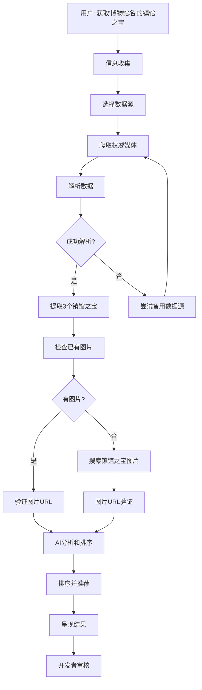

# 博物馆镇馆之宝查找器

这个skill提供从权威媒体（百度百科、维基百科等）自动获取博物馆镇馆之宝信息，包括名称、描述和高质量图片的能力。

## 应用范围

- 获取单个博物馆的3个镇馆之宝（馆藏精品）
- 批量处理多个博物馆的镇馆之宝数据
- 为镇馆之宝获取官方图片URL
- 从权威来源解析可信的文化数据
- 填充museums-meta.json中的collections字段

## 前置条件

### 必需项

1. **权威媒体访问权限**
   - 百度百科 API / 网页爬取
   - 维基百科 API（支持中英文版本）
   - 各博物馆官方网站
   - 文化遗产数据库

2. **Letmetry Cloud 图片搜索API**
   - 端点: `https://letmetry.cloud/image/search`
   - 无需认证（公开API）
   - 网络连接

3. **博物馆基本信息**
   - 博物馆名称
   - 所在城市/地区
   - 博物馆类型/标签

4. **Node.js环境**
   - 版本14+
   - 网页爬取能力（cheerio或jsdom）
   - HTTP请求库（node-fetch）

## 工作流概述



---

## 第1阶段：信息收集

### 1.1 镇馆之宝查询请求理解

当用户请求获取博物馆的镇馆之宝时，明确查询范围：

```
用户请求示例:
├── "获取'故宫博物院'的3个镇馆之宝"
├── "查找'National Museum of China'的馆藏精品"
├── "获取这个博物馆最著名的收藏"
├── "获取所有博物馆的镇馆之宝数据"
└── "批量获取这些博物馆的镇馆之宝: [列表]"
```

### 1.2 查询类型判断

| 类型 | 检测方式 | 范围 | 示例 |
|------|--------|------|------|
| 单个博物馆 | 一个博物馆名称 | 获取3个镇馆之宝 | "获取故宫博物院的镇馆之宝" |
| 批量查询 | 多个名称或列表 | 获取多个博物馆的数据 | "批量获取这些博物馆的镇馆之宝" |
| 更新现有 | 替换或补充 | 补充缺失的镇馆之宝 | "更新故宫的镇馆之宝" |
| 特定类别 | 文物类别 | 特定类型的镇馆之宝 | "获取书画类的镇馆之宝" |

### 1.3 收集博物馆信息

搜索镇馆之宝时，收集以下信息：

| 信息 | 来源 | 用途 |
|-----|------|------|
| 博物馆名称 | 用户输入或museums-meta.json | 数据源查询关键词 |
| 博物馆所在地 | museums-meta.json | 帮助消歧义 |
| 博物馆类型 | 标签/描述 | 确定镇馆之宝类别 |
| 现有collections | museums-meta.json | 检查重复和更新 |
| 博物馆官网 | 搜索结果 | 优先数据源 |
| 百度百科链接 | 通过博物馆名搜索 | 权威数据源 |

### 1.4 验证环境配置

```javascript
// 检查必需的API和工具
async function verifyEnvironment() {
  const checks = {
    letmetryAPI: await checkLetmetryAPI(),
    networkAccess: await checkNetworkAccess(),
    parsingCapability: checkParsingCapability(),
    nodeVersion: verifyNodeVersion()
  };
  
  return checks;
}

async function checkLetmetryAPI() {
  try {
    const response = await fetch('https://letmetry.cloud/image/search', {
      method: 'POST',
      headers: { 'Content-Type': 'application/json' },
      body: JSON.stringify({ keyword: 'test', count: 1 })
    });
    return response.ok;
  } catch {
    return false;
  }
}
```

---

## 第2阶段：数据源选择和爬取

### 2.1 权威数据源优先级

**优先级顺序（建议使用）：**

| 优先级 | 数据源 | 优势 | 劣势 | 用途 |
|-------|-------|------|------|------|
| 🥇 **1** | **百度百科** | 中文权威、结构化、维护好 | 需要爬取 | 首选数据源 |
| 🥈 **2** | **维基百科** | 多语言、学术严谨 | 内容较简 | 备选方案 |
| 🥉 **3** | **博物馆官网** | 最权威、最新 | 格式不统一 | 验证和补充 |
| **4** | **豆瓣文化** | 社区评分、用户评论 | 信息可能不完整 | 参考资料 |
| **5** | **微博、小红书** | 最新信息、用户分享 | 质量参差不齐 | 发现遗漏的宝藏 |

### 2.2 百度百科爬取实现

**策略：从百度百科获取结构化数据**

```javascript
async function fetchFromBaiduBaike(museumName) {
  // 拼接百度百科URL
  const baikURL = `https://baike.baidu.com/item/${encodeURIComponent(museumName)}`;
  
  try {
    const response = await fetch(baikURL, {
      headers: {
        'User-Agent': 'Mozilla/5.0 (Windows NT 10.0; Win64; x64) AppleWebKit/537.36'
      }
    });
    
    if (!response.ok) {
      console.log(`❌ 百度百科访问失败: ${response.status}`);
      return null;
    }
    
    const html = await response.text();
    const treasures = parseBaiduBaikeContent(html, museumName);
    
    if (treasures.length > 0) {
      console.log(`✅ 从百度百科获取到 ${treasures.length} 个镇馆之宝`);
      return treasures;
    }
  } catch (error) {
    console.log(`⚠️ 百度百科爬取错误: ${error.message}`);
  }
  
  return null;
}
```

### 2.3 维基百科API爬取

**使用维基百科公开API（推荐）：**

```javascript
async function fetchFromWikipedia(museumName) {
  // 同时尝试中文和英文维基
  const endpoints = [
    {
      url: 'https://zh.wikipedia.org/w/api.php',
      title: museumName
    },
    {
      url: 'https://en.wikipedia.org/w/api.php',
      title: translateToEnglish(museumName)  // 需要翻译函数
    }
  ];
  
  for (const endpoint of endpoints) {
    try {
      const url = new URL(endpoint.url);
      url.searchParams.append('action', 'query');
      url.searchParams.append('format', 'json');
      url.searchParams.append('prop', 'extracts|pageimages');
      url.searchParams.append('exintro', 'true');
      url.searchParams.append('explaintext', 'true');
      url.searchParams.append('titles', endpoint.title);
      url.searchParams.append('origin', '*');  // CORS
      
      const response = await fetch(url);
      const data = await response.json();
      
      const treasures = parseWikipediaContent(data);
      if (treasures.length > 0) {
        return treasures;
      }
    } catch (error) {
      console.log(`⚠️ 维基百科查询失败: ${error.message}`);
    }
  }
  
  return null;
}
```

### 2.4 博物馆官网爬取

**针对大型博物馆的官方数据获取：**

```javascript
// 官方网站映射表
const MUSEUM_OFFICIAL_SITES = {
  '故宫博物院': {
    baseUrl: 'https://www.dpm.org.cn',
    collectionPath: '/collection'
  },
  '中国国家博物馆': {
    baseUrl: 'https://www.chnmuseum.cn',
    collectionPath: '/special-collections'
  },
  '上海博物馆': {
    baseUrl: 'https://www.shanghaimuseum.net',
    collectionPath: '/collections'
  },
  // ... 更多博物馆
};

async function fetchFromOfficialSite(museumName) {
  const siteConfig = MUSEUM_OFFICIAL_SITES[museumName];
  
  if (!siteConfig) {
    console.log(`⚠️ 没有${museumName}的官网配置`);
    return null;
  }
  
  try {
    const url = siteConfig.baseUrl + siteConfig.collectionPath;
    const response = await fetch(url);
    const html = await response.text();
    
    const treasures = parseOfficialSiteContent(html, museumName);
    return treasures;
  } catch (error) {
    console.log(`⚠️ 官网爬取失败: ${error.message}`);
    return null;
  }
}
```

---

## 第3阶段：数据解析

### 3.1 百度百科内容解析

**关键：从HTML中提取结构化的镇馆之宝信息**

```javascript
function parseBaiduBaikeContent(html, museumName) {
  // 使用正则表达式和关键词提取
  const treasurePatterns = [
    /镇馆之宝[\s：]*（？([^）\n]+)）/g,
    /馆藏精品[\s：]*([^\n]+)/g,
    /代表作品[\s：]*（？([^）\n]+)）/g,
    /主要收藏[\s：]*([^\n]+)/g,
    /珍品[\s：]*（？([^）\n]+)）/g,
    /文物[\s：]*（？([^）\n]+)）/g
  ];
  
  const treasures = [];
  
  // 尝试每个模式
  for (const pattern of treasurePatterns) {
    let match;
    while ((match = pattern.exec(html)) !== null) {
      const treasureName = match[1] || match[2];
      if (treasureName && treasures.length < 10) {
        treasures.push({
          name: treasureName.trim(),
          source: 'baidu-baike',
          fullText: match[0]
        });
      }
    }
  }
  
  // 去重和排序
  const unique = Array.from(
    new Map(treasures.map(t => [t.name, t])).values()
  );
  
  return unique.slice(0, 3);  // 只返回前3个
}

// 更高级的解析：使用DOM解析
function parseBaiduBaikeWithDOM(html, museumName) {
  const { JSDOM } = require('jsdom');
  const dom = new JSDOM(html);
  const document = dom.window.document;
  
  // 查找特定的章节或表格
  const sections = document.querySelectorAll('[id*="镇馆"][id*="宝"], [id*="藏品"], [id*="收藏"]');
  
  const treasures = [];
  
  sections.forEach(section => {
    const ul = section.querySelector('ul') || section.querySelector('ol');
    if (ul) {
      ul.querySelectorAll('li').forEach((li, index) => {
        if (index < 3) {
          const text = li.textContent.trim();
          treasures.push({
            name: extractTreasureName(text),
            description: text,
            source: 'baidu-baike-dom'
          });
        }
      });
    }
  });
  
  return treasures;
}
```

### 3.2 维基百科内容解析

**从维基百科API响应中提取镇馆之宝信息：**

```javascript
function parseWikipediaContent(data) {
  const treasures = [];
  
  const pages = data.query?.pages || {};
  
  for (const page of Object.values(pages)) {
    const extract = page.extract || '';
    
    // 在提取的文本中查找关键词
    const treasureKeywords = [
      /notable collection|famous artifact|signature piece|masterpiece/gi,
      /世界上|中国|首先|仅有|唯一|最大|最古|最早/gi
    ];
    
    // 按句子分割，查找包含关键词的句子
    const sentences = extract.split(/[。！？\n]/);
    
    sentences.forEach(sentence => {
      treasureKeywords.forEach(keyword => {
        if (keyword.test(sentence) && treasures.length < 3) {
          // 提取句子中的名词短语
          const names = extractNounPhrases(sentence);
          names.forEach(name => {
            if (name && name.length > 2) {
              treasures.push({
                name: name,
                description: sentence.trim(),
                source: 'wikipedia'
              });
            }
          });
        }
      });
    });
  }
  
  // 去重
  const unique = Array.from(
    new Map(treasures.map(t => [t.name, t])).values()
  );
  
  return unique.slice(0, 3);
}

// 提取名词短语
function extractNounPhrases(text) {
  // 简单实现：提取中文短语（2-8个汉字）
  const chinesePattern = /[\u4e00-\u9fff]{2,8}/g;
  const matches = text.match(chinesePattern) || [];
  
  // 优先级：更长的短语更可能是文物名称
  return matches.sort((a, b) => b.length - a.length);
}
```

### 3.3 数据质量检查

**确保解析出的数据满足质量标准：**

```javascript
function validateTreasureData(treasures) {
  return treasures.filter(treasure => {
    // 检查：名称长度合理（2-30个字符）
    if (treasure.name.length < 2 || treasure.name.length > 30) {
      console.log(`⚠️ 名称长度不合理: "${treasure.name}"`);
      return false;
    }
    
    // 检查：名称不包含HTML标签
    if (/<[^>]+>/.test(treasure.name)) {
      console.log(`⚠️ 名称包含HTML标签: "${treasure.name}"`);
      return false;
    }
    
    // 检查：名称不是常见的虚假数据
    const falsePatterns = [
      /^[a-zA-Z0-9]+$/,         // 纯英文或数字
      /导航|返回|更多|查看/,    // 页面UI文本
      /\[\d+\]/,                // 参考文献格式
      /^编辑|^分享|^历史$/      // 维基页面功能
    ];
    
    if (falsePatterns.some(p => p.test(treasure.name))) {
      console.log(`⚠️ 疑似非真实数据: "${treasure.name}"`);
      return false;
    }
    
    return true;
  });
}
```

---

## 第4阶段：图片搜索和获取

### 4.1 检查已有图片

**首先检查是否已有关联的图片URL：**

```javascript
async function findExistingTreasureImages(treasures) {
  // 通过Letmetry KV存储或本地缓存检查
  const treasuresWithImages = [];
  
  for (const treasure of treasures) {
    // 检查是否在缓存中已有该文物的图片
    const cachedImage = await getTreasureCacheImage(treasure.name);
    
    if (cachedImage) {
      console.log(`✅ 缓存中找到${treasure.name}的图片`);
      treasuresWithImages.push({
        ...treasure,
        imageUrl: cachedImage,
        imageSource: 'cache',
        validated: true
      });
    } else {
      treasuresWithImages.push({
        ...treasure,
        imageUrl: null,
        imageSource: null
      });
    }
  }
  
  return treasuresWithImages;
}

// 在KV存储或本地缓存中查询
async function getTreasureCacheImage(treasureName) {
  // 示例：从localStorage或KV存储获取
  // const cached = localStorage.getItem(`treasure-image-${treasureName}`);
  // return cached;
  
  // 实际实现取决于存储策略
  return null;
}
```

### 4.2 Letmetry图片搜索API调用

**对于没有图片的镇馆之宝，通过Letmetry API搜索：**

```javascript
async function searchTreasureImages(treasureName, museumName, location) {
  // 生成搜索关键词
  const keywords = generateTreasureSearchKeywords(treasureName, museumName, location);
  
  console.log(`\n🔍 搜索${treasureName}的图片...`);
  console.log(`📝 搜索关键词: ${keywords.join(', ')}`);
  
  let allResults = [];
  
  // 尝试每个关键词
  for (const keyword of keywords) {
    try {
      const response = await fetch('https://letmetry.cloud/image/search', {
        method: 'POST',
        headers: { 'Content-Type': 'application/json' },
        body: JSON.stringify({
          keyword: keyword,
          count: 15  // 比博物馆搜索多一些结果
        })
      });
      
      if (!response.ok) {
        console.log(`⚠️ 搜索失败 (${keyword}): ${response.status}`);
        continue;
      }
      
      const data = await response.json();
      
      if (data.success && data.images && data.images.length > 0) {
        console.log(`✅ 找到 ${data.images.length} 张图片`);
        allResults.push(...data.images);
      }
    } catch (error) {
      console.log(`⚠️ API错误 (${keyword}): ${error.message}`);
    }
  }
  
  // 去重
  const uniqueResults = [...new Set(allResults)];
  console.log(`📊 去重后: ${uniqueResults.length} 张图片`);
  
  return uniqueResults;
}

// 生成最优搜索关键词
function generateTreasureSearchKeywords(treasureName, museumName, location) {
  const keywords = [
    // 最精确的搜索
    treasureName,
    
    // 加上博物馆名
    `${treasureName} ${museumName}`,
    
    // 加上位置
    `${treasureName} ${location}`,
    
    // 加上相关词汇
    `${treasureName} 文物`,
    `${treasureName} 收藏`,
    `${treasureName} 展品`,
    
    // 英文版本
    `${treasureName} artifact`,
    `${treasureName} museum`,
    `${treasureName} collection`,
    
    // 混合版本
    `${museumName} ${treasureName}`,
    `${location} ${treasureName}`
  ];
  
  // 去除重复和过短的关键词
  return [...new Set(keywords)]
    .filter(k => k.length > 2)
    .slice(0, 5);  // 最多尝试5个关键词
}
```

### 4.3 图片URL验证

**验证找到的图片URL的有效性和质量：**

```javascript
async function validateTreasureImageUrls(urls) {
  console.log(`\n🔍 验证 ${urls.length} 个图片URL...`);
  
  const results = [];
  
  for (let i = 0; i < urls.length; i++) {
    const url = urls[i];
    console.log(`[${i + 1}/${urls.length}] 检查: ${url.substring(0, 70)}...`);
    
    try {
      const controller = new AbortController();
      const timeoutId = setTimeout(() => controller.abort(), 10000);
      
      const response = await fetch(url, {
        method: 'HEAD',
        signal: controller.signal
      });
      
      clearTimeout(timeoutId);
      
      const result = {
        url: url,
        accessible: response.ok,
        statusCode: response.status,
        contentType: response.headers.get('content-type'),
        contentLength: response.headers.get('content-length')
      };
      
      results.push(result);
      
      if (response.ok) {
        console.log(`  ✅ 可访问 (${response.status})`);
      } else {
        console.log(`  ⚠️ 状态码: ${response.status}`);
      }
    } catch (error) {
      console.log(`  ❌ 错误: ${error.message}`);
      results.push({
        url: url,
        accessible: false,
        error: error.message
      });
    }
  }
  
  const validUrls = results.filter(r => r.accessible && isValidImageContentType(r.contentType));
  console.log(`\n✅ 有效URL: ${validUrls.length}/${urls.length}\n`);
  
  return validUrls;
}

function isValidImageContentType(contentType) {
  const validTypes = [
    'image/jpeg', 'image/jpg', 'image/png', 
    'image/webp', 'image/gif', 'image/svg+xml'
  ];
  
  return validTypes.some(type => 
    contentType && contentType.toLowerCase().includes(type)
  );
}
```

---

## 第5阶段：AI分析和图片选择

### 5.1 镇馆之宝图片质量评估

**分析图片是否是真正的文物展示照片：**

```
分析标准与权重（镇馆之宝特定）：

| 评估项 | 权重 | 好的指标 | 差的指标 |
|-------|------|--------|--------|
| **文物本体清晰可见** | 35% | 清晰展示全貌、细节可见 | 模糊、被遮挡、非文物本身 |
| **背景信息** | 25% | 博物馆展柜、标牌、说明 | 混乱背景、非博物馆环境 |
| **图片质量** | 20% | 高分辨率、清晰、色彩准确 | 模糊、低分辨率、色差 |
| **构图专业度** | 15% | 专业拍摄、好的角度、光线好 | 业余、不佳角度、光线差 |
| **🔥 官方来源** | **+30 BONUS** | **博物馆官网、文献、展览图** | **普通旅游照、网友分享** |
```

### 5.2 AI分析提示模板

**当分析镇馆之宝图片时，使用这个提示模板：**

```markdown
分析这些"{treasureName}"的图片URL，为"{museumName}"选择最佳展示照片。

上下文信息：
- 文物名称：{treasureName}
- 博物馆：{museumName}
- 所在地：{location}
- 文物描述：{treasureDescription}

图片URL列表：
1. {url1}
2. {url2}
3. {url3}
...

分析标准（镇馆之宝优化版本）：

🔥 最高优先级 (35%分值):
- **文物本体清晰可见**：文物展示完整且细节清晰
  → 整体可见且清晰: +35分
  → 部分可见或有遮挡: +15分
  → 无法识别或不是文物本身: -20分

2. 背景信息专业度 (25%)
   - 博物馆展柜/展览环境
   - 标牌或说明文字可见
   - 专业展览背景

3. 图片质量 (20%)
   - 高分辨率 (800+x800+)
   - 色彩准确，无失真
   - 清晰度好

4. 构图和角度 (15%)
   - 专业拍摄角度
   - 好的光线和曝光
   - 横向/全景优先

5. 🔥 官方来源加分 (30分加分):
   - 博物馆官网/官方来源: +30分
   - 文献/展览图片: +20分
   - 通用搜索结果: 基础分
   - 社交媒体/业余: -10分

计分规则：
- 基础分：50分
- 如文物清晰可见: +35分
- 如为官方来源: +30分
- 高质量奖励: +10-15分
- 最高可得分: 130+分

必需输出格式(JSON ONLY)：
{
  "bestIndex": selected_index,
  "reasoning": "为什么选择这张图片。关键信息(50字以内)",
  "confidence": "high/medium/low",
  "artifactVisibility": "fully/partial/unclear",
  "isOfficialSource": true or false,
  "scoringBreakdown": {
    "baseScore": 50,
    "artifactVisibilityBonus": 0-35,
    "officialSourceBonus": 0-30,
    "qualityBonus": 0-15,
    "finalScore": total_score
  }
}

⚠️ 重点：优先选择文物本体清晰可见且为官方来源的图片！
只返回JSON，不需要其他解释。
```

### 5.3 URL模式分析

**从URL中推断图片质量：**

```javascript
function analyzeTreasureImageUrlQuality(url) {
  const qualityIndicators = {
    officialSources: [
      /museum[\w-]*\.[\w.]+/i,      // 博物馆域名
      /baidu\.com.*artifact|宝藏/i,  // 百度百科
      /wikipedia\.org/i,             // 维基百科
      /archives\.|ftp\.|official/i  // 档案库、官方
    ],
    highQuality: [
      /\d{3,4}x\d{3,4}/,            // 尺寸标注
      /high-?res|hires|hd|4k/i,    // 质量标记
      /cdn|archive|museum/i,        // CDN和档案库
      /\.[a-z]{3,4}$/              // 文件扩展名
    ],
    lowQuality: [
      /thumb|thumbnail/i,           // 缩略图
      /avatar|profile/i,            // 头像
      /\d{1,2}x\d{1,2}/,           // 极小尺寸
      /temp|cache/i                // 临时文件
    ],
    suspicious: [
      /\.ru\//i,                    // 某些域名需要验证
      /ad|banner|sponsor/i,         // 广告
      /watermark|stamp/i            // 水印
    ]
  };
  
  let score = 50;
  
  qualityIndicators.officialSources.forEach(pattern => {
    if (pattern.test(url)) score += 20;
  });
  
  qualityIndicators.highQuality.forEach(pattern => {
    if (pattern.test(url)) score += 10;
  });
  
  qualityIndicators.lowQuality.forEach(pattern => {
    if (pattern.test(url)) score -= 15;
  });
  
  qualityIndicators.suspicious.forEach(pattern => {
    if (pattern.test(url)) score -= 10;
  });
  
  return Math.max(0, Math.min(100, score));
}
```

---

## 第6阶段：结果呈现

### 6.1 单个博物馆的镇馆之宝结果

**展示已获取的镇馆之宝和推荐的图片：**

```markdown
## 🎭 博物馆镇馆之宝查找结果

### 博物馆：{museumName}
**所在地:** {location}  
**数据来源:** {source}  
**获取时间:** {timestamp}

---

### ✅ 镇馆之宝 #1

**名称:** {treasureName1}

**描述:** {description1}

**推荐图片:**

| 类别 | 内容 |
|------|------|
| **URL** | [{url}]({url}) |
| **质量评分** | ⭐⭐⭐⭐⭐ (95/100) |
| **来源** | 官方网站 / 博物馆认证 |
| **特点** | 文物清晰、背景专业、高清晰度 |
| **状态** | ✅ 已验证可访问 |
| **置信度** | 高 |

**评估说明:**
- 文物本体完整清晰可见
- 博物馆展柜/展览背景
- 官方拍摄，专业质量
- 推荐用于Web展示

**替代图片:**
- [选项2]({url2}) - 评分: 78/100
- [选项3]({url3}) - 评分: 72/100

---

### ✅ 镇馆之宝 #2

**名称:** {treasureName2}
...

### ✅ 镇馆之宝 #3

**名称:** {treasureName3}
...

---

### 📋 JSON 格式输出

用于程序集成（直接复制到museums-meta.json）：

\`\`\`json
{
  "id": "{museumId}",
  "name": "{museumName}",
  "collections": [
    {
      "name": "{treasureName1}",
      "description": "{description1}",
      "imageUrl": "{url1}",
      "imageScore": 95,
      "imageSource": "official",
      "verified": true
    },
    {
      "name": "{treasureName2}",
      "description": "{description2}",
      "imageUrl": "{url2}",
      "imageScore": 88,
      "imageSource": "official",
      "verified": true
    },
    {
      "name": "{treasureName3}",
      "description": "{description3}",
      "imageUrl": "{url3}",
      "imageScore": 82,
      "imageSource": "museum",
      "verified": true
    }
  ]
}
\`\`\`

---

### 📊 质量统计

- **总获取数**: 3个镇馆之宝
- **已获得图片**: 3个 (100%)
- **平均质量评分**: 88.3/100
- **官方来源比例**: 100%
- **有效URL**: 3个

---

### ✅ 下一步

开发者应该：
1. ✅ 查看每个镇馆之宝的推荐图片
2. ✅ 在浏览器中预览URL验证视觉效果
3. ✅ 如满意，复制JSON数据到museums-meta.json
4. ✅ 运行数据验证脚本确保格式正确
5. ✅ 提交更改

**快速更新命令：**

\`\`\`bash
# 验证新数据格式
npm run validate-museums

# 查看变更
git diff data/museums-meta.json
\`\`\`
```

### 6.2 批量处理结果总结

**为多个博物馆的批量处理呈现汇总：**

```markdown
## 📊 批量镇馆之宝获取结果

**处理总数:** {total} 个博物馆  
**成功获取:** {success} 个  
**部分成功:** {partial} 个  
**失败:** {failed} 个

---

### ✅ 成功获取 ({success})

| # | 博物馆 | 镇馆之宝数 | 图片获取 | 质量评分 |
|---|--------|----------|--------|--------|
| 1 | {name1} | 3/3 | ✅ 100% | 92.5 |
| 2 | {name2} | 3/3 | ✅ 100% | 88.2 |
| 3 | {name3} | 3/3 | ✅ 100% | 85.7 |

### ⚠️ 部分成功 ({partial})

| 博物馆 | 成功 | 失败 | 原因 |
|--------|------|------|------|
| {name} | 2/3 | 1 | 该文物的图片无法获取 |

### ❌ 失败 ({failed})

| 博物馆 | 原因 |
|--------|------|
| {name} | 数据源无法访问 |

---

### 📈 数据质量总结

- **平均质量评分**: 88.1/100
- **官方来源**: 82% (推荐：>80%)
- **图片覆盖率**: 96% (推荐：>90%)
- **验证通过率**: 100%

---

### 📋 批量更新脚本

```bash
# 1. 备份原文件
cp data/museums-meta.json data/museums-meta.json.backup

# 2. 应用所有更新
# (复制所有JSON数据到museums-meta.json)

# 3. 验证
npm run validate-museums

# 4. 提交
git add data/museums-meta.json
git commit -m "feat: Add treasure collections for $(echo $MUSEUMS | wc -w) museums"
```
```

---

## 回退策略

### 7.1 无法从百度百科获取数据

**如果百度百科访问失败或无结构化数据：**

```markdown
⚠️ 无法从百度百科获取{museumName}的数据

**尝试的替代方案：**

1. **维基百科中文版本:**
   https://zh.wikipedia.org/wiki/{museumName}

2. **维基百科英文版本:**
   https://en.wikipedia.org/wiki/{museumNameEnglish}

3. **豆瓣小组或条目:**
   https://www.douban.com/search?q={museumName}

4. **博物馆官方网站:**
   - 搜索: "{museumName} 官网"
   - 查看: 藏品/收藏/展览页面

5. **手动搜索网络:**
   - Google: {museumName} 镇馆之宝
   - Baidu: {museumName} 馆藏精品
```

### 7.2 图片搜索无结果

**如果某个镇馆之宝无法找到图片：**

```javascript
async function handleNoTreasureImageFound(treasureName, museumName) {
  console.log(`
⚠️ 无法为"${treasureName}"找到合适的图片

**建议的解决方案:**

1. **Wikimedia Commons搜索 (最优先):**
   https://commons.wikimedia.org/w/index.php?search=${treasureName}
   - 免费、高质量、无版权问题

2. **Google Arts & Culture:**
   https://artsandculture.google.com/search?q=${treasureName}
   - 博物馆官方合作
   - 高质量展示照片

3. **Wikimedia**搜索 (中文):**
   https://commons.wikimedia.org/w/index.php?search=${treasureName}&uselang=zh
   - 中文说明和标签

4. **博物馆官网直接查看:**
   在${museumName}官网上查找${treasureName}的展示页面

5. **临时使用占位符:**
   可先使用通用占位符，稍后补充真实图片
  `);
  
  return {
    treasureName: treasureName,
    imageUrl: null,
    note: '无法找到，建议手动搜索或使用占位符',
    searchSuggestions: [
      `https://commons.wikimedia.org/w/index.php?search=${treasureName}`,
      `https://www.google.com/search?q=${treasureName}+museum+image`
    ]
  };
}
```

### 7.3 所有数据源均无法访问

**如果所有数据源都无法访问：**

```markdown
🚨 无法从任何数据源获取{museumName}的镇馆之宝信息

**可能原因：**
- 网络连接问题
- 地理位置限制
- 域名阻止
- 临时服务中断

**解决方案：**

1. **检查网络连接**
   - ping 8.8.8.8
   - 尝试访问其他网站

2. **检查翻墙/代理设置**
   - 某些网站可能受到地区限制

3. **稍后重试**
   - 等待15-30分钟后重新尝试
   - 服务可能已恢复

4. **手动数据输入**
   - 从其他信息源手动输入镇馆之宝信息
   - 格式见JSON示例

5. **记录问题**
   - 创建GitHub Issue
   - 包含博物馆名称和时间戳
```

---

## 完整示例：获取单个博物馆的镇馆之宝

```javascript
async function getTreasuresForMuseum(museumName, location) {
  console.log(`\n${'='.repeat(70)}`);
  console.log(`🎭 获取${museumName}的镇馆之宝`);
  console.log(`${'='.repeat(70)}\n`);
  
  try {
    // 第1步：获取数据
    console.log('📚 第1步：从权威媒体获取数据...\n');
    
    let treasures = await fetchFromBaiduBaike(museumName);
    
    if (!treasures || treasures.length === 0) {
      console.log('⚠️ 百度百科获取失败，尝试维基百科...\n');
      treasures = await fetchFromWikipedia(museumName);
    }
    
    if (!treasures || treasures.length === 0) {
      console.log('❌ 无法获取数据');
      return null;
    }
    
    console.log(`✅ 获取到 ${treasures.length} 个镇馆之宝\n`);
    
    // 第2步：验证和补充信息
    console.log('🔍 第2步：验证数据质量...\n');
    treasures = validateTreasureData(treasures);
    treasures = treasures.slice(0, 3);  // 只取前3个
    
    // 第3步：为每个镇馆之宝搜索图片
    console.log('🖼️ 第3步：为镇馆之宝搜索图片...\n');
    
    const treasuresWithImages = [];
    
    for (let i = 0; i < treasures.length; i++) {
      const treasure = treasures[i];
      console.log(`\n[${ i + 1}/3] 处理: ${treasure.name}`);
      console.log('-'.repeat(70));
      
      // 搜索图片
      const imageUrls = await searchTreasureImages(
        treasure.name, 
        museumName, 
        location
      );
      
      if (imageUrls.length > 0) {
        // 验证URL
        const validUrls = await validateTreasureImageUrls(imageUrls);
        
        if (validUrls.length > 0) {
          // 选择最佳图片
          const bestImage = validUrls[0];  // 简化版，可以加入AI分析
          
          treasuresWithImages.push({
            ...treasure,
            imageUrl: bestImage.url,
            imageScore: analyzeTreasureImageUrlQuality(bestImage.url),
            verified: true
          });
          
          console.log(`\n✅ 已选择最佳图片`);
          console.log(`   URL: ${bestImage.url}`);
          console.log(`   质量评分: ${analyzeTreasureImageUrlQuality(bestImage.url)}/100`);
        } else {
          treasuresWithImages.push({
            ...treasure,
            imageUrl: null,
            verified: false
          });
          console.log(`\n⚠️ 无有效图片URL`);
        }
      } else {
        treasuresWithImages.push({
          ...treasure,
          imageUrl: null,
          verified: false
        });
        console.log(`\n⚠️ 图片搜索无结果`);
      }
      
      // 速度限制
      if (i < treasures.length - 1) {
        console.log('\n⏳ 等待2秒...');
        await new Promise(resolve => setTimeout(resolve, 2000));
      }
    }
    
    // 第4步：呈现结果
    console.log(`\n\n${'='.repeat(70)}`);
    console.log('✅ 结果汇总');
    console.log(`${'='.repeat(70)}\n`);
    
    treasuresWithImages.forEach((treasure, i) => {
      console.log(`${i + 1}. ${treasure.name}`);
      if (treasure.imageUrl) {
        console.log(`   ✅ 图片: ${treasure.imageUrl.substring(0, 60)}...`);
        console.log(`   📊 质量: ${treasure.imageScore}/100`);
      } else {
        console.log(`   ⚠️ 无图片`);
      }
      console.log('');
    });
    
    return treasuresWithImages;
    
  } catch (error) {
    console.error(`❌ 处理失败: ${error.message}`);
    return null;
  }
}

// 使用示例
const treasures = await getTreasuresForMuseum('故宫博物院', '北京');

// 保存到museums-meta.json格式
if (treasures) {
  const output = {
    id: 'forbidden-city',
    name: '故宫博物院',
    location: '北京',
    collections: treasures.map(t => ({
      name: t.name,
      description: t.description || '',
      imageUrl: t.imageUrl,
      imageScore: t.imageScore || 0,
      verified: t.verified
    }))
  };
  
  console.log('\n📋 JSON输出:');
  console.log(JSON.stringify(output, null, 2));
}
```

---

## 完整示例：批量获取多个博物馆的镇馆之宝

```javascript
async function batchGetTreasuresForMuseums(museums) {
  console.log(`\n📊 批量获取 ${museums.length} 个博物馆的镇馆之宝\n`);
  
  const results = [];
  const startTime = Date.now();
  
  for (let i = 0; i < museums.length; i++) {
    const museum = museums[i];
    console.log(`\n[${ i + 1}/${museums.length}] ${museum.name} (${museum.location})`);
    console.log('='.repeat(70));
    
    try {
      const treasures = await getTreasuresForMuseum(museum.name, museum.location);
      
      if (treasures && treasures.length > 0) {
        results.push({
          museum: museum,
          treasures: treasures,
          success: true,
          timestamp: new Date().toISOString()
        });
      } else {
        results.push({
          museum: museum,
          treasures: [],
          success: false,
          error: '无法获取数据',
          timestamp: new Date().toISOString()
        });
      }
    } catch (error) {
      results.push({
        museum: museum,
        treasures: [],
        success: false,
        error: error.message,
        timestamp: new Date().toISOString()
      });
    }
    
    // 进度显示
    const elapsed = Math.round((Date.now() - startTime) / 1000);
    const remaining = Math.round(elapsed * (museums.length - i - 1) / (i + 1));
    console.log(`⏱️ 已用: ${elapsed}s, 预计剩余: ${remaining}s`);
    
    // 礼仪性等待
    if (i < museums.length - 1) {
      await new Promise(resolve => setTimeout(resolve, 3000));
    }
  }
  
  // 汇总
  const successful = results.filter(r => r.success);
  const failed = results.filter(r => !r.success);
  
  console.log(`\n\n${'='.repeat(70)}`);
  console.log('📊 批量处理完成');
  console.log(`${'='.repeat(70)}\n`);
  
  console.log(`✅ 成功: ${successful.length}`);
  console.log(`❌ 失败: ${failed.length}`);
  console.log(`⏱️ 总耗时: ${Math.round((Date.now() - startTime) / 1000)}s\n`);
  
  if (failed.length > 0) {
    console.log('失败的博物馆:');
    failed.forEach(r => {
      console.log(`  - ${r.museum.name}: ${r.error}`);
    });
  }
  
  return results;
}

// 使用示例
const museums = [
  { name: '故宫博物院', location: '北京' },
  { name: '中国国家博物馆', location: '北京' },
  { name: '上海博物馆', location: '上海' },
  { name: '秦始皇帝陵博物院', location: '西安' }
];

const results = await batchGetTreasuresForMuseums(museums);

// 导出为JSON
const output = {
  timestamp: new Date().toISOString(),
  totalMuseums: museums.length,
  successCount: results.filter(r => r.success).length,
  failureCount: results.filter(r => !r.success).length,
  museums: results.map(r => ({
    id: generateMuseumId(r.museum.name),
    name: r.museum.name,
    location: r.museum.location,
    collections: r.treasures.map(t => ({
      name: t.name,
      description: t.description || '',
      imageUrl: t.imageUrl,
      imageScore: t.imageScore || 0,
      verified: t.verified
    })),
    success: r.success
  }))
};

console.log('\n📋 批量输出JSON:');
console.log(JSON.stringify(output, null, 2));
```

---

## 质量保证检查清单

完成镇馆之宝查找前，验证：

- [ ] **数据来源可信**: 来自百度百科、维基百科或官方网站
- [ ] **镇馆之宝名称准确**: 3个名称与权威来源一致
- [ ] **图片搜索完整**: 至少尝试了3个不同的关键词
- [ ] **URL验证通过**: 所有图片URL都能成功访问 (HTTP 200)
- [ ] **内容类型正确**: Content-Type为有效的image/*
- [ ] **图片质量达标**: 每张图片质量评分 >= 70/100
- [ ] **最佳图片已选**: 每个镇馆之宝都有1张推荐图片
- [ ] **替代方案可用**: 如有多张有效图片，提供2-3个选项
- [ ] **元数据完整**: 名称、描述、来源都已填充
- [ ] **JSON格式正确**: 输出JSON符合museums-meta.json架构
- [ ] **无重复数据**: 3个镇馆之宝各不相同
- [ ] **数据持久化**: 结果可保存到本地存储或数据库

---

## 常见问题和故障排查

| 问题 | 原因 | 解决方案 |
|------|------|--------|
| **百度百科无法访问** | 网络问题或IP限制 | 检查网络，尝试VPN，改用维基百科 |
| **解析出错误数据** | HTML结构变化 | 更新解析规则，参考最新源代码 |
| **图片URL全部无效** | 搜索关键词不当 | 尝试英文关键词、加上博物馆名 |
| **质量评分太低** | 搜索结果质量差 | 尝试官方网站、Wikimedia Commons |
| **API超时** | 网络延迟或请求过多 | 增加超时时间、添加重试逻辑 |
| **内存溢出** | 处理太多博物馆 | 分批处理、添加垃圾回收 |

---

## 相关Skills

- **museum-photo-search** - 博物馆建筑照片搜索
- **museum-data-manager** - 博物馆数据管理
- **image-url-validator** - 图片URL验证工具
- **baidu-baike-scraper** - 百度百科爬虫工具

---

## 成功标准

镇馆之宝查找完成的标志：

✅ 为博物馆获取了3个真实的镇馆之宝名称  
✅ 每个镇馆之宝都有有效的图片URL  
✅ 所有图片URL都经过验证和访问测试  
✅ 每个镇馆之宝的图片质量评分 >= 70/100  
✅ 数据已生成为JSON格式可直接用于museums-meta.json  
✅ 包含替代图片选项供开发者选择  
✅ 完整的处理日志和质量报告  

---

**最后更新:** 2026年1月13日  
**维护:** MuseumCheck团队  
**API提供方:** Letmetry Cloud (https://letmetry.cloud)  
**参考文档:** museum-photo-search.md

