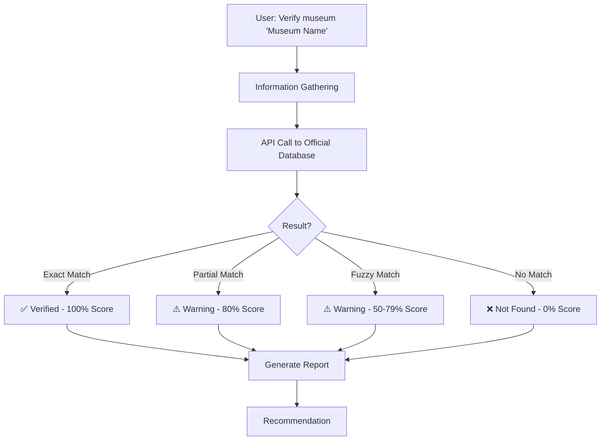

# Museum Official Verification

This skill provides strict quality control for museum data by verifying museums against China's official museum database powered by Letmetry Cloud.

## Scope of Application

- Adding new museums to MuseumCheck
- Validating existing museum names
- Batch verification of museum lists
- Compliance checking against official standards
- Quality assurance during development

## Prerequisites

### Required

1. **Letmetry Cloud API Access**
   - Endpoint: `https://letmetry.cloud/museum/search`
   - No authentication required (public API)
   - Network connectivity

2. **Tool Installation**
   - CLI tool: `tools/verify-museum-official.js`
   - API method: `LetmetryAPI.verifyMuseumOfficial()` in `js/letmetry-cloud-api.js`
   - Pre-commit hook: `.husky/pre-commit`

3. **Node.js Environment** (for CLI usage)
   - Version 14+ required

## Workflow Overview



---

## Step 1: Information Gathering Phase

### 1.1 Verification Request Understanding

When user asks to verify museums, clarify the scope:

```
User Request Examples:
├── "Verify museum 'Museum Name'"
├── "Check if 'Museum Name' is in the official database"
├── "Validate these museums: [list]"
├── "Ensure all museums in script.js are official"
└── "What's the official name for this museum?"
```

### 1.2 Determine Verification Type

| Type | Detection | Tool | Example |
|------|-----------|------|---------|
| Single Museum | One museum name | CLI: single | `node tools/verify-museum-official.js "故宫博物院"` |
| Batch | JSON file or array | CLI: --batch | `node tools/verify-museum-official.js --batch museums.json` |
| Script Full | Check script.js | CLI: --verify-script | `node tools/verify-museum-official.js --verify-script script.js` |
| Strict Mode | Production-ready | CLI: --strict | For commits and releases |
| Normal Mode | Development | CLI: (default) | For suggestions and exploration |

### 1.3 Gather Museum Information

When verifying, collect:

| Item | Source | Purpose |
|------|--------|---------|
| Museum Name | User input or script.js | Primary identifier |
| Location | Optional, from context | Helps with disambiguation |
| Purpose | User request | Determine strict/normal mode |
| Scope | Single or batch | Choose verification method |

### 1.4 Verify Environment Setup

```bash
# Check if verification tool is available
ls -la tools/verify-museum-official.js

# Check if API is accessible
curl -X POST https://letmetry.cloud/museum/search \
  -H "Content-Type: application/json" \
  -d '{"museumName": "test"}'

# Verify Node.js
node --version  # Should be v14+
```

---

## Step 2: Verification Phase

### 2.1 Single Museum Verification

**Flow:**

```bash
# 1. Basic verification (normal mode, ≥60% match accepted)
node tools/verify-museum-official.js "Museum Name"

# 2. Strict verification (100% exact match required)
node tools/verify-museum-official.js "Museum Name" --strict

# 3. Detailed verification
node tools/verify-museum-official.js "Museum Name" --verbose
```

**Interpretation:**

| Output Symbol | Meaning | Action |
|---|---|---|
| ✅ | Museum verified | Proceed with data entry |
| ⚠️ | Partial match found | Review suggestion, use official name |
| ❌ | Not found or low match | Verify museum spelling, search official DB |

### 2.2 Batch Verification

**Flow:**

```bash
# 1. Prepare JSON file with museums
cat > museums.json << 'EOF'
[
  { "name": "Museum 1" },
  { "name": "Museum 2" },
  { "name": "Museum 3" }
]
EOF

# 2. Run batch verification
node tools/verify-museum-official.js --batch museums.json

# 3. For strict mode (commit-ready)
node tools/verify-museum-official.js --batch museums.json --strict
```

**Report Analysis:**

```
Summary:
  ✅ Passed: 3       → All ready for production
  ⚠️ Warned: 0       → Partial matches, need review
  ❌ Failed: 0       → Not found, need correction
```

### 2.3 Script.js Verification

**Flow:**

```bash
# 1. Sample check (first 10 museums)
node tools/verify-museum-official.js --verify-script script.js

# 2. Detailed sample check
node tools/verify-museum-official.js --verify-script script.js --verbose

# 3. Strict sample check
node tools/verify-museum-official.js --verify-script script.js --strict
```

**When to use:**

- During development to check data quality
- Before creating a PR to ensure compliance
- As part of CI/CD quality gates

### 2.4 API Response Interpretation

**Success Response Structure:**

```javascript
{
  status: 'success',
  verified: true,                    // Pass/fail indicator
  museumName: 'User Input',
  strictMode: false,                 // Verification mode
  bestMatch: {
    name: 'Official Name',           // Use this in code
    province: 'Province',
    qualityGrade: '一级',            // Quality tier
    score: 100,                      // Match percentage
    matchType: 'exact',              // exact|partial|fuzzy
    collectionCount: '123456',
    visitorCount: '1234.5'           // Annual visitors (万人)
  },
  allMatches: [ /* alternatives */ ]
}
```

**Error Response:**

```javascript
{
  status: 'not_found' | 'error',
  verified: false,
  error: 'Museum not found in official database'
}
```

### 2.5 Scoring Interpretation

| Score | Match Type | Mode: Normal | Mode: Strict | Action |
|---|---|---|---|---|
| 100% | Exact | ✅ Pass | ✅ Pass | Use as-is |
| 80% | Partial | ✅ Pass | ❌ Fail | Use official name |
| 50-79% | Fuzzy | ❌ Fail | ❌ Fail | Find better match |
| <50% | No Match | ❌ Fail | ❌ Fail | Verify museum exists |

---

## Step 3: Verification Results Handling

### 3.1 Successful Verification (✅)

**When museum gets 100% match:**

```
✅ Museum Name
   Official Name: Official Name
   Province: Beijing
   Quality Grade: Grade I
   Match Score: 100% (exact)
```

**Action:**
1. ✅ Safe to use in code
2. ✅ No name changes needed
3. ✅ Can include in production
4. ✅ Ready for commit

### 3.2 Partial Match Warning (⚠️)

**When museum gets 80% match:**

```
⚠️ Museum Name (Input)
   Best Match: Official Museum Name
   Province: Province
   Match Score: 80% (partial)
   Other matches:
     - Alternative Name 1
     - Alternative Name 2
```

**Action:**
1. Review the official match
2. Update code to use official name
3. If multiple matches exist, choose the most appropriate
4. Re-verify if uncertain

### 3.3 No Match / Low Match (❌)

**When museum gets <60% match or not found:**

```
❌ Museum Name
   Error: Museum not found in official database
```

**Action:**
1. Verify the museum exists in reality
2. Try alternative spellings
3. Check if museum name is commonly used
4. Search official China museum database manually
5. Contact maintainers if museum should be included

### 3.4 Implementation Pattern

**For code changes:**

```javascript
// After verification confirms 100% match
const museum = {
  id: 'museum-id',
  name: 'Official Name from Verification',  // Use exact official name
  location: 'Province from Verification',
  description: '...',
  tags: ['tag1', 'tag2']
};
```

---

## Step 4: Integration with Development Workflow

### 4.1 Pre-Commit Hook Automation

**Automatic trigger when committing:**

```bash
git add script.js
git commit -m "Add museum: Museum Name"

# Pre-commit hook automatically:
# 1. Detects changed museums
# 2. Runs verification in strict mode
# 3. Blocks commit if verification fails
# 4. Shows error with resolution steps
```

**Hook behavior:**

| Scenario | Action |
|----------|--------|
| ✅ All verified | Commit proceeds normally |
| ❌ Verification fails | Commit blocked, shows command to fix |
| ⚠️ Network error | Retry or use `--no-verify` (not recommended) |

### 4.2 Manual Verification Before Commit

**Recommended workflow:**

```bash
# 1. Before committing, verify manually
node tools/verify-museum-official.js "New Museum" --strict --verbose

# 2. If verification passes, proceed with commit
git add script.js
git commit -m "Add museum: New Museum"

# 3. Pre-commit hook will confirm
```

### 4.3 Batch Museum Addition

**For adding multiple museums:**

```bash
# 1. Prepare list
cat > new-museums.json << 'EOF'
[
  "Museum 1",
  "Museum 2",
  "Museum 3"
]
EOF

# 2. Verify batch
node tools/verify-museum-official.js --batch new-museums.json --strict

# 3. Fix any failures
# - Update names to match official database
# - Verify corrected list
node tools/verify-museum-official.js --batch new-museums.json --strict

# 4. Only commit after all pass
git add script.js
git commit -m "Add museums: Museum 1, Museum 2, Museum 3"
```

---

## Step 5: Troubleshooting & Resolution

### 5.1 Common Issues

| Issue | Cause | Resolution |
|---|---|---|
| **API Connection Failed** | Network issue | Check internet, retry after seconds |
| **Museum Not Found** | Wrong spelling or new museum | Verify official name via manual search |
| **Strict Mode Failure** | Name doesn't match 100% | Use official name from API response |
| **Pre-commit Hook Error** | Hook not executable | `chmod +x .husky/pre-commit` |
| **Node not found** | Node.js not installed | Install Node.js v14+ |

### 5.2 Resolution Steps

**If verification fails:**

```bash
# Step 1: Try with verbose output
node tools/verify-museum-official.js "Museum" --verbose

# Step 2: Check if official name differs
# Look at "Other matches:" section

# Step 3: Update code with official name
# Edit script.js to use the official name from API

# Step 4: Re-verify
node tools/verify-museum-official.js "Official Name" --strict

# Step 5: Commit
git add script.js
git commit -m "Add museum: Official Name"
```

**If pre-commit hook blocks commit:**

```bash
# Option 1: Fix and retry (recommended)
# 1. Run manual verification
node tools/verify-museum-official.js "Museum" --strict --verbose

# 2. Update code
# 3. Retry commit
git add script.js
git commit -m "Fix museum name"

# Option 2: Emergency bypass (NOT recommended)
git commit --no-verify -m "Emergency: Add museum"
# WARNING: Bypasses quality checks, use only in emergencies
```

---

## Step 6: Quality Assurance & Verification

### 6.1 Verification Checklist

Before considering a museum verified, confirm:

- [ ] API returns `status: 'success'`
- [ ] `verified: true` or score >= 100% (strict mode)
- [ ] Museum name matches official database exactly
- [ ] Province/location information matches
- [ ] Quality grade is visible (一级/二级/三级)
- [ ] Collection count and visitor data available
- [ ] Pre-commit hook passes (if committed)

### 6.2 Report Generation

**Generate verification report:**

```bash
# Text report
node tools/verify-museum-official.js --verify-script script.js --verbose

# Save to file
node tools/verify-museum-official.js --verify-script script.js > verification-report.txt
```

### 6.3 Continuous Monitoring

**Keep museums up-to-date:**

```bash
# Periodic full verification
npm run verify:script

# Check specific museum
npm run verify:museum "Museum Name"

# Before each release
npm run verify:strict
```

---

## Reference Information

### API Scoring System

```
Match Type  | Score | Criteria
────────────┼───────┼──────────────────────────────
Exact       | 100%  | name1 === name2
Partial     | 80%   | name1 contains name2 OR vice versa
Fuzzy       | 50-79%| Partial character match
No Match    | <50%  | Minimal similarity
```

### Official Database Fields

API returns complete official museum data:

```javascript
{
  name: 'Official Name',
  province: 'Province Name',
  nature: 'Museum Type',
  qualityGrade: 'Grade Level (一级/二级/三级)',
  freeAdmission: 'Yes/No',
  collectionCount: 'Total Items',
  preciousArtifactsCount: 'Rare Items',
  exhibitionsCount: 'Annual Exhibitions',
  educationalActivitiesCount: 'Annual Activities',
  visitorCount: 'Annual Visitors (万人)'
}
```

### Tools & Resources

| Tool | Location | Purpose |
|------|----------|---------|
| CLI Tool | `tools/verify-museum-official.js` | Command-line verification |
| API Method | `js/letmetry-cloud-api.js` | Programmatic verification |
| Pre-commit Hook | `.husky/pre-commit` | Automatic quality gate |
| Tests | `tests/museum-verification.test.js` | Unit test suite |

### Related Skills

- **Museum Data Manager** - Manage museum database
- **Web Design Reviewer** - Check UI/UX quality
- **Data Quality Checker** - Validate data integrity

---

## Common Commands Quick Reference

```bash
# Verify single museum
node tools/verify-museum-official.js "Museum Name"

# Strict verification (for commits)
node tools/verify-museum-official.js "Museum Name" --strict

# Batch verification
node tools/verify-museum-official.js --batch museums.json --strict

# Script verification
node tools/verify-museum-official.js --verify-script script.js --verbose

# Help
node tools/verify-museum-official.js --help

# With npm scripts (if configured)
npm run verify:museum "Museum Name"
npm run verify:batch museums.json
npm run verify:script
```

---

## Success Criteria

Museum verification is complete when:

✅ API returns 100% exact match  
✅ Official name is confirmed  
✅ Pre-commit hook passes (if committed)  
✅ Museum data appears in script.js with official name  
✅ All verification tests pass  
✅ Code review approved  

---

**Last Updated:** January 13, 2026  
**Maintained By:** MuseumCheck Team  
**Related Docs:** `docs/guides/museum-verification-strict-guide.md`
