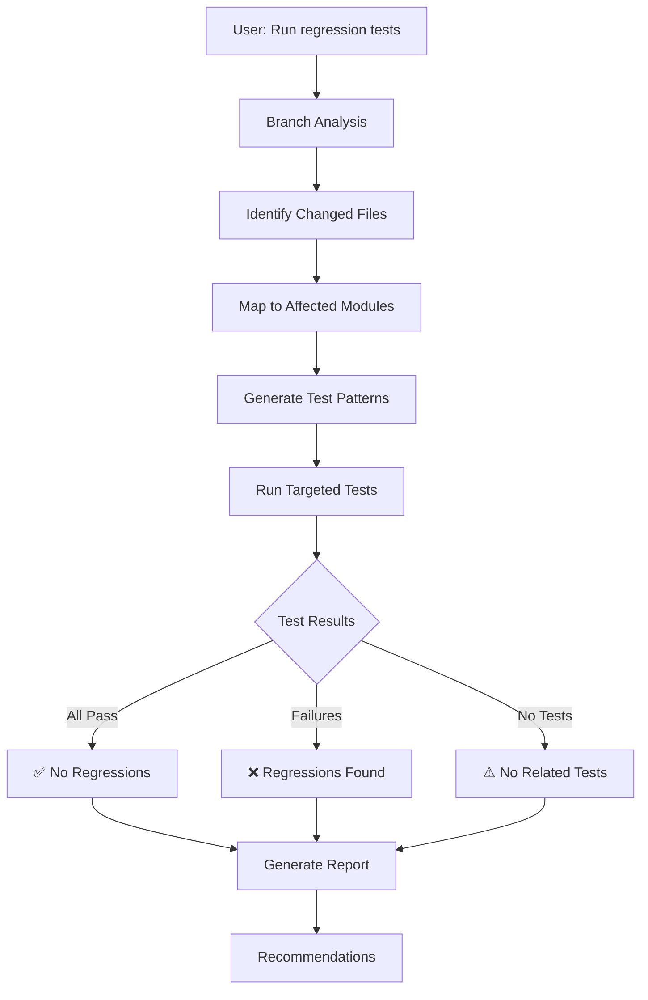

# Regression Test Gatekeeper

This skill provides intelligent regression testing by analyzing code changes between the current branch and main, identifying affected modules, and running only the relevant tests to ensure comprehensive coverage while minimizing execution time.

## Scope of Application

- Pre-merge regression testing
- Pull request validation
- Branch comparison testing
- Impact analysis for code changes
- Continuous integration quality gates
- Development workflow optimization

## Prerequisites

### Required

1. **Git Repository**
   - Clean working directory
   - Main branch available for comparison
   - Git history accessible

2. **Jest Testing Framework**
   - Jest configured with `--findRelatedTests` support
   - Test files following naming conventions
   - Coverage collection enabled

3. **Node.js Environment**
   - Version 14+ required
   - npm scripts available
   - Test dependencies installed

## Workflow Overview



---

## Step 1: Branch Analysis Phase

### 1.1 Regression Test Request Understanding

When user asks for regression testing, clarify the scope:

```
User Request Examples:
├── "Run regression tests"
├── "Check for regressions in my changes"
├── "Test affected modules only"
├── "Validate my branch against main"
├── "Run targeted tests for my changes"
└── "What tests should I run for these changes?"
```

### 1.2 Environment Verification

```bash
# Check git status
git status --porcelain

# Verify current branch
git branch --show-current

# Ensure main branch exists
git branch -r | grep origin/main

# Check Jest availability
npm test -- --help | grep findRelatedTests

# Verify test files exist
find tests -name "*.test.js" | head -5
```

### 1.3 Branch Comparison Setup

```bash
# Get main branch reference
MAIN_BRANCH="origin/main"
CURRENT_BRANCH=$(git branch --show-current)

# Check if we have main branch
if ! git rev-parse --verify $MAIN_BRANCH >/dev/null 2>&1; then
  echo "Main branch not found, using local main"
  MAIN_BRANCH="main"
fi

# Get diff base
DIFF_BASE="$MAIN_BRANCH...$CURRENT_BRANCH"
echo "Comparing: $DIFF_BASE"
```

---

## Step 2: Change Analysis Phase

### 2.1 Identify Changed Files

**Get comprehensive file changes:**

```bash
# Get all changed files
CHANGED_FILES=$(git diff --name-only $DIFF_BASE)

# Get file types and statistics
git diff --stat $DIFF_BASE

# Get deleted files (for impact analysis)
DELETED_FILES=$(git diff --name-only --diff-filter=D $DIFF_BASE)

# Get new files
NEW_FILES=$(git diff --name-only --diff-filter=A $DIFF_BASE)

# Get modified files
MODIFIED_FILES=$(git diff --name-only --diff-filter=M $DIFF_BASE)
```

### 2.2 Categorize Changes by Impact

**File type impact mapping:**

| File Type | Impact Level | Test Priority | Related Test Areas |
|-----------|--------------|---------------|-------------------|
| `*.js` | High | Critical | Unit tests, integration tests |
| `*.html` | Medium | High | E2E tests, UI tests |
| `*.css` | Medium | Medium | Visual regression tests |
| `*.json` | Low-Medium | Medium | Config tests, data tests |
| `*.md` | Low | Low | Documentation tests |
| `test*` | Low | Low | Test infrastructure tests |

**Module mapping:**

```javascript
const MODULE_MAPPING = {
  // Core functionality
  'script.js': ['tests/unit/', 'tests/integration/'],
  'js/': ['tests/unit/', 'tests/features/'],
  'core/': ['tests/unit/core/', 'tests/integration/'],
  
  // UI Components
  'css/': ['tests/ui/', 'tests/e2e/'],
  '*.html': ['tests/e2e/', 'tests/pages/'],
  
  // Data and configuration
  'data/': ['tests/data-quality/', 'tests/unit/'],
  'config/': ['tests/unit/', 'tests/integration/'],
  
  // Tools and utilities
  'tools/': ['tests/tools/', 'tests/unit/'],
  'scripts/': ['tests/scripts/', 'tests/unit/'],
  
  // Survey and quiz modules
  'survey/': ['tests/features/survey/', 'tests/e2e/'],
  'quiz/': ['tests/features/quiz/', 'tests/unit/quiz/'],
  
  // Admin functionality
  'admin/': ['tests/features/admin/', 'tests/e2e/admin/']
};
```

### 2.3 Generate Test Patterns

**Create test file patterns based on changes:**

```bash
# Initialize test patterns array
TEST_PATTERNS=()

# Add direct test files
for file in $CHANGED_FILES; do
  # Find corresponding test file
  if [[ "$file" == *.js ]]; then
    test_file="tests/$(basename "$file" .js).test.js"
    if [[ -f "$test_file" ]]; then
      TEST_PATTERNS+=("$test_file")
    fi
  fi
done

# Add directory-based tests
for file in $CHANGED_FILES; do
  dir=$(dirname "$file")
  
  # Map directory to test directories
  case "$dir" in
    "js"|"core")
      TEST_PATTERNS+=("tests/unit/" "tests/features/")
      ;;
    "css")
      TEST_PATTERNS+=("tests/ui/" "tests/e2e/")
      ;;
    "survey")
      TEST_PATTERNS+=("tests/features/survey/" "tests/e2e/")
      ;;
    "quiz")
      TEST_PATTERNS+=("tests/features/quiz/" "tests/unit/quiz/")
      ;;
    "admin")
      TEST_PATTERNS+=("tests/features/admin/" "tests/e2e/admin/")
      ;;
    "data")
      TEST_PATTERNS+=("tests/data-quality/")
      ;;
    "tools")
      TEST_PATTERNS+=("tests/tools/")
      ;;
    "scripts")
      TEST_PATTERNS+=("tests/scripts/")
      ;;
  esac
done

# Remove duplicates
TEST_PATTERNS=($(printf "%s\n" "${TEST_PATTERNS[@]}" | sort -u))
```

---

## Step 3: Test Execution Phase

### 3.1 Prepare Test Command

**Build Jest command with patterns:**

```bash
# Base test command
BASE_CMD="npm test --"

# Add findRelatedTests flag
BASE_CMD="$BASE_CMD --findRelatedTests"

# Add changed files as patterns
if [[ ${#TEST_PATTERNS[@]} -gt 0 ]]; then
  # Convert patterns to Jest arguments
  PATTERN_ARGS=$(printf "'%s' " "${TEST_PATTERNS[@]}")
  TEST_CMD="$BASE_CMD $PATTERN_ARGS"
else
  # Fallback to all tests if no patterns found
  TEST_CMD="npm test"
fi

echo "Test command: $TEST_CMD"
```

### 3.2 Execute Targeted Tests

**Run the regression test suite:**

```bash
# Create test results file
RESULTS_FILE="regression-test-results-$(date +%Y%m%d-%H%M%S).json"
REPORT_FILE="regression-report-$(date +%Y%m%d-%H%M%S).md"

# Run tests with coverage and detailed output
echo "Running regression tests..."
echo "Command: $TEST_CMD"
echo "Results file: $RESULTS_FILE"
echo ""

# Execute tests and capture results
$TEST_CMD \
  --coverage \
  --verbose \
  --json \
  --outputFile="$RESULTS_FILE" \
  2>&1 | tee "regression-test-log-$(date +%Y%m%d-%H%M%S).txt"

TEST_EXIT_CODE=${PIPESTATUS[0]}
```

### 3.3 Handle Different Test Scenarios

**Scenario 1: Tests Found and Executed**

```bash
if [[ $TEST_EXIT_CODE -eq 0 ]]; then
  echo "✅ All regression tests passed!"
  echo "No regressions detected in affected modules."
  
  # Parse results for summary
  if [[ -f "$RESULTS_FILE" ]]; then
    TOTAL_TESTS=$(jq '.numTotalTests // 0' "$RESULTS_FILE")
    PASSED_TESTS=$(jq '.numPassedTests // 0' "$RESULTS_FILE")
    COVERAGE=$(jq '.coverageMap | keys | length' "$RESULTS_FILE")
    
    echo "Test Summary:"
    echo "  Total tests: $TOTAL_TESTS"
    echo "  Passed: $PASSED_TESTS"
    echo "  Coverage files: $COVERAGE"
  fi
else
  echo "❌ Regression tests failed!"
  echo "Some tests failed, indicating potential regressions."
  
  # Show failed tests
  if [[ -f "$RESULTS_FILE" ]]; then
    FAILED_TESTS=$(jq -r '.testResults[] | select(.status == "failed") | .name' "$RESULTS_FILE")
    echo ""
    echo "Failed tests:"
    echo "$FAILED_TESTS"
  fi
fi
```

**Scenario 2: No Related Tests Found**

```bash
if [[ ${#TEST_PATTERNS[@]} -eq 0 ]]; then
  echo "⚠️ No related tests found for changed files."
  echo ""
  echo "Changed files:"
  echo "$CHANGED_FILES"
  echo ""
  echo "Recommendations:"
  echo "1. Consider adding tests for modified modules"
  echo "2. Run full test suite: npm test"
  echo "3. Manual testing may be required"
  
  # Offer to run full suite
  read -p "Run full test suite instead? (y/N): " -n 1 -r
  echo
  if [[ $REPLY =~ ^[Yy]$ ]]; then
    echo "Running full test suite..."
    npm test -- --coverage
  fi
fi
```

**Scenario 3: Test Infrastructure Issues**

```bash
# Check for common issues
if ! command -v npm &> /dev/null; then
  echo "❌ npm not found. Please install Node.js and npm."
  exit 1
fi

if ! npm test -- --help 2>/dev/null | grep -q findRelatedTests; then
  echo "⚠️ Jest --findRelatedTests not available."
  echo "Falling back to full test suite..."
  npm test
  exit $?
fi

if [[ ! -d "tests" ]]; then
  echo "❌ No tests directory found."
  echo "Please ensure tests are properly set up."
  exit 1
fi
```

---

## Step 4: Results Analysis Phase

### 4.1 Generate Regression Report

**Create comprehensive regression report:**

```bash
cat > "$REPORT_FILE" << EOF
# Regression Test Report

**Generated:** $(date '+%Y-%m-%d %H:%M:%S')  
**Branch:** $CURRENT_BRANCH  
**Comparison:** $DIFF_BASE  
**Test Command:** $TEST_CMD  

## Summary

| Metric | Value |
|--------|-------|
| Exit Code | $TEST_EXIT_CODE |
| Status | $([ $TEST_EXIT_CODE -eq 0 ] && echo "✅ PASSED" || echo "❌ FAILED") |

## Changed Files Analysis

### Files Changed
\`\`\`
$CHANGED_FILES
\`\`\`

### Impact Assessment
EOF

# Add impact analysis based on file types
if echo "$CHANGED_FILES" | grep -q "\.js$"; then
  echo "- **JavaScript files modified**: High impact - core functionality affected" >> "$REPORT_FILE"
fi

if echo "$CHANGED_FILES" | grep -q "\.html$"; then
  echo "- **HTML files modified**: Medium impact - UI structure affected" >> "$REPORT_FILE"
fi

if echo "$CHANGED_FILES" | grep -q "\.css$"; then
  echo "- **CSS files modified**: Medium impact - styling affected" >> "$REPORT_FILE"
fi

if echo "$CHANGED_FILES" | grep -q "data/"; then
  echo "- **Data files modified**: High impact - museum data affected" >> "$REPORT_FILE"
fi

# Add test results if available
if [[ -f "$RESULTS_FILE" ]]; then
  cat >> "$REPORT_FILE" << EOF

## Test Results

### Overall Statistics
- Total Tests: $(jq '.numTotalTests // 0' "$RESULTS_FILE")
- Passed: $(jq '.numPassedTests // 0' "$RESULTS_FILE")
- Failed: $(jq '.numFailedTests // 0' "$RESULTS_FILE")
- Skipped: $(jq '.numPendingTests // 0' "$RESULTS_FILE")
- Duration: $(jq '.numTotalTestSuites // 0' "$RESULTS_FILE") test suites

### Coverage Summary
EOF
  
  # Add coverage information if available
  if jq -e '.coverageMap' "$RESULTS_FILE" >/dev/null 2>&1; then
    echo "Coverage data available in results file." >> "$REPORT_FILE"
  fi
fi

# Add recommendations
cat >> "$REPORT_FILE" << EOF

## Recommendations

EOF

if [[ $TEST_EXIT_CODE -eq 0 ]]; then
  echo "✅ **No regressions detected** - Changes appear to be safe" >> "$REPORT_FILE"
  echo "🚀 **Ready for merge** - All affected tests passing" >> "$REPORT_FILE"
else
  echo "❌ **Regressions found** - Fix failing tests before merging" >> "$REPORT_FILE"
  echo "🔧 **Action required** - Review and fix test failures" >> "$REPORT_FILE"
fi

if [[ ${#TEST_PATTERNS[@]} -eq 0 ]]; then
  echo "⚠️ **Consider adding tests** for modified modules to improve coverage" >> "$REPORT_FILE"
fi

echo "Report saved to: $REPORT_FILE"
EOF
```

### 4.2 Display Results Summary

**Show user-friendly summary:**

```bash
echo ""
echo "=== REGRESSION TEST SUMMARY ==="
echo ""

if [[ $TEST_EXIT_CODE -eq 0 ]]; then
  echo "🎉 RESULT: PASSED"
  echo "✅ No regressions detected in your changes"
  echo ""
  echo "📊 CHANGES ANALYSIS:"
  echo "   Files changed: $(echo "$CHANGED_FILES" | wc -l | tr -d ' ')"
  echo "   Test patterns: ${#TEST_PATTERNS[@]}"
  echo ""
  echo "🚀 NEXT STEPS:"
  echo "   • Your changes are ready for review"
  echo "   • Consider adding tests for untested modules"
  echo "   • Proceed with merge/PR creation"
else
  echo "🚨 RESULT: FAILED"
  echo "❌ Regressions detected - fixes needed"
  echo ""
  echo "📊 CHANGES ANALYSIS:"
  echo "   Files changed: $(echo "$CHANGED_FILES" | wc -l | tr -d ' ')"
  echo "   Test patterns: ${#TEST_PATTERNS[@]}"
  echo ""
  echo "🔧 NEXT STEPS:"
  echo "   • Review failed tests and fix issues"
  echo "   • Re-run regression tests after fixes"
  echo "   • Ensure all tests pass before merging"
fi

echo ""
echo "📄 Detailed report: $REPORT_FILE"
echo "📊 Test results: $RESULTS_FILE"
echo ""
```

---

## Step 5: Integration & Automation

### 5.1 Git Hook Integration

**Add to pre-commit or pre-push hook:**

```bash
# Add to .husky/pre-commit
echo "Running regression tests..."
npm run regression:test

if [[ $? -ne 0 ]]; then
  echo "❌ Regression tests failed. Commit blocked."
  echo "Fix issues and try again, or use --no-verify to bypass (not recommended)."
  exit 1
fi
```

### 5.2 CI/CD Pipeline Integration

**GitHub Actions workflow:**

```yaml
name: Regression Tests
on: [pull_request]

jobs:
  regression:
    runs-on: ubuntu-latest
    steps:
      - uses: actions/checkout@v3
        with:
          fetch-depth: 0
      
      - name: Setup Node.js
        uses: actions/setup-node@v3
        with:
          node-version: '20'
          cache: 'npm'
      
      - name: Install dependencies
        run: npm ci
      
      - name: Run regression tests
        run: npm run regression:test
      
      - name: Upload results
        uses: actions/upload-artifact@v3
        if: always()
        with:
          name: regression-results
          path: regression-*.md
```

### 5.3 NPM Scripts Integration

**Add to package.json:**

```json
{
  "scripts": {
    "regression:test": "node scripts/regression-gatekeeper.js",
    "regression:full": "npm test -- --coverage --verbose",
    "regression:affected": "npm test -- --findRelatedTests",
    "regression:report": "node scripts/regression-gatekeeper.js --report-only"
  }
}
```

---

## Step 6: Advanced Features

### 6.1 Smart Test Selection

**Implement intelligent test mapping:**

```javascript
// Advanced module mapping with dependency tracking
const DEPENDENCY_GRAPH = {
  'script.js': ['js/', 'core/', 'css/', 'data/'],
  'core/data-manager.js': ['data/', 'core/storage/'],
  'js/achievement-gamification.js': ['css/achievement-gamification.css'],
  'quiz/js/quiz-engine.js': ['quiz/css/', 'quiz/data/']
};

function getAffectedFiles(changedFile) {
  const affected = new Set([changedFile]);
  
  // Add dependencies
  if (DEPENDENCY_GRAPH[changedFile]) {
    DEPENDENCY_GRAPH[changedFile].forEach(dep => affected.add(dep));
  }
  
  // Add dependents (reverse lookup)
  Object.entries(DEPENDENCY_GRAPH).forEach(([file, deps]) => {
    if (deps.includes(changedFile)) {
      affected.add(file);
    }
  });
  
  return Array.from(affected);
}
```

### 6.2 Performance Optimization

**Parallel test execution:**

```bash
# Split tests by module for parallel execution
if [[ ${#TEST_PATTERNS[@]} -gt 5 ]]; then
  echo "Large test set detected, considering parallel execution..."
  
  # Create test groups
  UNIT_TESTS=$(printf "%s\n" "${TEST_PATTERNS[@]}" | grep "tests/unit/")
  E2E_TESTS=$(printf "%s\n" "${TEST_PATTERNS[@]}" | grep "tests/e2e/")
  FEATURE_TESTS=$(printf "%s\n" "${TEST_PATTERNS[@]}" | grep "tests/features/")
  
  # Run unit tests first (fastest)
  if [[ -n "$UNIT_TESTS" ]]; then
    echo "Running unit tests..."
    npm test -- $UNIT_TESTS
  fi
fi
```

### 6.3 Historical Analysis

**Track regression patterns:**

```bash
# Maintain regression history
HISTORY_FILE=".regression-history.json"

# Update history
cat >> "$HISTORY_FILE" << EOF
{
  "timestamp": "$(date -Iseconds)",
  "branch": "$CURRENT_BRANCH",
  "commit": "$(git rev-parse HEAD)",
  "changed_files": $(echo "$CHANGED_FILES" | jq -R . | jq -s .),
  "test_patterns": $(printf "%s\n" "${TEST_PATTERNS[@]}" | jq -R . | jq -s .),
  "result": "$TEST_EXIT_CODE",
  "duration": "$TEST_DURATION"
}
EOF
```

---

## Common Commands Quick Reference

```bash
# Basic regression test
npm run regression:test

# Regression with specific branch
npm run regression:test -- --branch feature-branch

# Regression with detailed output
npm run regression:test -- --verbose

# Regression only (no execution)
npm run regression:test -- --dry-run

# Full regression suite
npm run regression:full

# Affected tests only
npm run regression:affected

# Generate report only
npm run regression:report
```

---

## Troubleshooting

### Common Issues

| Issue | Cause | Resolution |
|-------|-------|------------|
| **No tests found** | No test files match patterns | Add tests or run full suite |
| **Git comparison fails** | Main branch not available | Fetch main or use local branch |
| **Jest findRelatedTests missing** | Jest version too old | Update Jest to latest version |
| **Permission denied** | Hook not executable | `chmod +x .husky/pre-commit` |
| **Network issues** | Can't fetch main branch | Use local comparison or retry |

### Debug Mode

```bash
# Enable debug output
DEBUG=regression:* npm run regression:test

# Verbose git operations
GIT_TRACE=1 npm run regression:test

# Show Jest configuration
npm test -- --showConfig
```

---

## Success Criteria

Regression testing is complete when:

✅ Branch differences analyzed  
✅ Affected modules identified  
✅ Targeted tests executed  
✅ Results report generated  
✅ Recommendations provided  
✅ No regressions detected (exit code 0)  

---

**Last Updated:** January 24, 2026  
**Maintained By:** MuseumCheck Team  
**Related Docs:** `docs/guides/testing-strategy.md`
